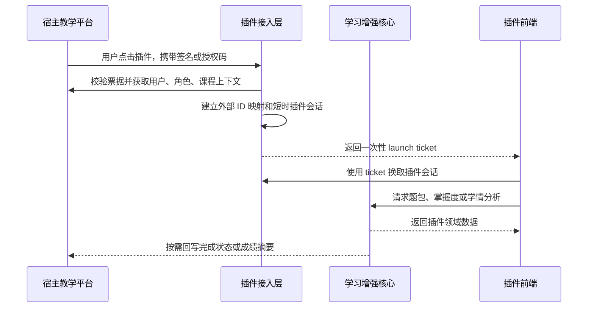

# 小型化插件定位与项目结构现状

> 审查日期：2026-07-24  
> 审查分支：`summer-update`  
> 目标定位：将现有“AI 智慧课程平台”收缩为可嵌入学习通等教学平台的学习增强插件。

## 1. 结论摘要

当前项目已经具备较完整的教学平台能力，但仍是一个独立平台，不是可直接安装到第三方教学平台中的插件。

项目最有价值、也最适合插件化的部分是：

1. 基于真实答题证据更新知识点掌握度。
2. 将知识点掌握度聚合为能力图谱。
3. 根据当前知识点、同能力点和历史薄弱点生成个性化题包。
4. 为教师提供风险预警、共性问题聚类和教学建议。
5. 以爬塔形式提供可选的游戏化学习体验。

账号注册、班级管理、课程管理、资源管理、任务发布和通用成绩管理与学习通类平台已有能力高度重叠。插件化后，这些数据应以宿主平台为准，本项目只保存必要的外部 ID 映射和增量学习数据。

建议将产品定位收敛为：

> **面向现有教学平台的 AI 个性化学习与学情增强插件。**  
> 宿主平台负责用户、课程、班级、资源和任务；插件负责学习证据、知识掌握、能力变化、个性化练习、AI 分析和游戏化呈现。

现阶段不建议拆成多个微服务。更合适的形态是一个边界清晰的模块化单体，加一个可嵌入的前端入口。

## 2. 当前仓库规模

| 项目 | 当前数量 |
|------|----------|
| 后端 Java 代码 | 约 18,509 行 |
| 前端 Vue/JavaScript 代码 | 约 16,517 行 |
| 后端控制器 | 35 个 |
| 后端服务及实现 | 97 个文件 |
| 后端实体 | 39 个 |
| Mapper | 39 个 |
| HTTP 映射注解 | 约 227 个 |
| 前端 API 导出 | 131 个 |
| 前端路由 | 31 个 |
| 前端页面 | 29 个 |
| Kingbase 初始化表 | 42 张 |
| 后端测试文件 | 37 个 |
| 前端测试文件 | 4 个 |

从规模和功能覆盖看，项目已经超过“小型插件”的合理边界。问题主要不是代码行数，而是平台基础能力与差异化能力混在同一个应用中。

## 3. 当前结构

```text
Practical-training/
├── frontend/                 Vue 3 单页应用
│   ├── views/                登录、课程、任务、教师管理、学生游戏等 29 个页面
│   ├── components/           题包、能力图谱和游戏房间组件
│   ├── api/index.js          131 个接口函数集中在单文件
│   └── router/index.js       教师、学生、管理员路由集中配置
├── backend/                  Spring Boot 3.5 模块化程度有限的单体
│   ├── controller/           课程、任务、题库、资源、学生、教师等通用能力
│   ├── service/              核心业务服务
│   ├── profile/              学生画像、推荐和游戏化相关模块
│   ├── module5_analytics/    学情分析模块
│   ├── agentic/              AI 统一调用客户端
│   ├── dify/                 Dify 客户端
│   └── resources/            数据库结构、初始化数据和 Mapper XML
├── harmonyOS/                独立 HarmonyOS 学生端
├── agentic/                  预留目录，当前没有独立 AI 服务实现
├── resource/                 本地课程、视频和作业文件
├── scripts/                  数据初始化、审计和开发启动脚本
├── specs/                    需求与实施计划
└── docs/                     架构、接口、部署和测试文档
```

### 3.1 后端形态

后端是一个 Spring Boot 应用，使用 MyBatis-Plus 和 PostgreSQL/KingbaseES。所有功能共享一个进程、一个数据库和一个上下文路径 `/practical-training`。

已有一定模块划分：

- `profile/` 聚合学生画像、推荐和部分游戏逻辑。
- `module5_analytics/` 聚合班级学情分析。
- `agentic/` 封装 DeepSeek、Dify、HTTP 和 mock 模式。

仍然扁平或交叉的部分：

- 课程、课时、任务、题库、提交、掌握度和爬塔服务集中在根级 `controller/service/mapper/entity`。
- 业务权限由各 Controller 手工调用 `Auth` 判断。
- 部分新旧接口同时保留，例如 `/api/...` 与历史路径并存。
- 初始化迁移、示例数据和运行时业务共处一个应用。

### 3.2 前端形态

前端是一个 Vue 3 SPA，同时承载三类角色：

- 学生端：课程、任务、画像、错题、能力图谱和爬塔。
- 教师端：课程、任务、学情分析、班级运营和能力图谱配置。
- 管理员端：学生、教师、课程和题库管理。

教师和管理员使用完整顶部栏、侧栏和独立导航。学生登录后，大量传统页面会被路由守卫重定向到爬塔地图。这说明学生体验已经开始收敛，但整个前端仍以独立平台为入口，尚无“嵌入模式”或“宿主上下文模式”。

### 3.3 HarmonyOS 端

HarmonyOS 端是第二套学生客户端，并允许用户在登录页手工填写后端地址。它适合独立 App 演示，但对“学习通插件”首期目标不是必要依赖。

建议保留源码和能力验证，首期插件化不把 HarmonyOS 作为交付主线。

## 4. 当前能力边界

### 4.1 与宿主平台重复的能力

以下能力在当前项目中是完整平台功能，插件化后通常不应继续作为主数据来源：

| 当前能力 | 当前实现 | 插件化建议 |
|----------|----------|------------|
| 学生、教师注册登录 | 本地账号、密码和 HttpSession | 改为宿主单点登录和身份映射 |
| 管理员后台 | 独立学生、教师、课程、题库管理页面 | 默认关闭，只保留运维所需最小后台 |
| 课程与课时 | 本地课程、课时表和 CRUD | 从宿主读取或按需同步 |
| 班级与成员 | 本地班级和学生关系 | 宿主为事实源，插件只缓存映射 |
| 课程资源 | 本地上传和磁盘存储 | 优先引用宿主资源 URL |
| 学习任务 | 本地创建、分配、提交和评分 | 首期消费宿主任务事件，不重复建设 |
| 通用成绩统计 | 本地提交与成绩汇总 | 只保留插件产生的学习证据和派生指标 |

### 4.2 应保留的插件核心

| 核心能力 | 当前基础 | 插件价值 |
|----------|----------|----------|
| 知识图谱 | 知识点、关系、资源关联 | 为课程内容建立可计算结构 |
| 能力图谱 | 能力点及知识点映射 | 将细粒度掌握度转成教师可理解的能力 |
| 学习证据 | 答题结果、难度、首次/重复作答 | 为个性化计算提供可信输入 |
| 掌握度计算 | 渐进更新和历史记录 | 避免简单的 0/100 跳变 |
| 个性化题包 | 诊断、普通、精英、Boss 策略 | 构成插件的主要学习体验 |
| 能力快照 | 评价前后能力聚合 | 支撑真实的能力变化展示 |
| AI 学情分析 | 聚类、建议、评阅和问答 | 降低教师分析成本 |
| 游戏化体验 | 爬塔路线和房间机制 | 作为可选前端皮肤，提高参与度 |

## 5. 插件化就绪度

| 维度 | 现状 | 判断 |
|------|------|------|
| 差异化业务能力 | 知识掌握、题包、能力图谱、AI 分析已经形成闭环 | 较强 |
| 业务模块边界 | 部分模块独立，但通用 LMS 与插件核心仍交叉 | 中等偏弱 |
| 身份集成 | 仅支持本地账号密码和 HttpSession | 不具备 |
| 宿主数据映射 | 没有平台、租户、外部用户、外部课程和外部班级 ID | 不具备 |
| 页面嵌入 | 只有完整 SPA 和自身导航，没有嵌入入口 | 不具备 |
| API 契约 | 接口较全，但数量大、兼容路径多、版本边界不清晰 | 中等偏弱 |
| 数据隔离 | 数据按课程和学生区分，但没有租户维度 | 不具备多学校隔离 |
| 文件存储 | 依赖本机相对目录 | 仅适合单机开发 |
| AI 接入 | 已有统一客户端和多模式配置 | 中等 |
| 部署交付 | 有本地脚本，无 Docker、正式部署清单和 CI 流水线 | 较弱 |
| 自动化测试 | 后端已有一定覆盖，前端覆盖较少 | 中等偏弱 |

综合判断：**业务核心可以插件化，但平台接入能力尚未开始建设。**

## 6. 主要阻塞点

### 6.1 身份和安全模型仍是独立平台模型

当前登录流程直接校验本地 `student/teacher` 表，并将完整实体放入 `HttpSession`。前端再把用户对象写入 `localStorage` 判断角色。

具体问题：

1. 没有宿主平台签名校验、授权码交换或单点登录入口。
2. 没有外部用户 ID 到插件内部主体 ID 的映射。
3. 当前数据库密码字段和登录比较仍是明文模型。
4. 权限判断分散在 Controller，缺少统一鉴权拦截层。
5. 当前会话 Cookie 没有针对跨站 iframe 的 `SameSite`、安全域名和 HTTPS 策略。

在身份桥接完成前，不应把页面直接嵌入第三方平台。

### 6.2 缺少租户与外部对象映射

当前主要业务键是 `studentNo`、`teacherNo` 和 `courseCode`。数据库没有以下概念：

- `platform_id`
- `tenant_id`
- `external_user_id`
- `external_course_id`
- `external_class_id`
- `external_activity_id`

因此不同学校或不同宿主实例出现相同课程编号、学号时会发生冲突，也无法稳定处理宿主对象更新。

### 6.3 数据所有权没有分层

当前系统同时拥有用户、课程、班级、资源、任务、提交、成绩和插件派生数据。作为插件后，容易出现两套数据互相覆盖的问题。

必须明确：

| 数据 | 建议事实源 |
|------|------------|
| 用户身份、角色 | 宿主平台 |
| 课程、班级、选课关系 | 宿主平台 |
| 原始课件、任务、基础成绩 | 宿主平台 |
| 知识点与能力点配置 | 插件 |
| 插件答题证据 | 插件 |
| 掌握度、能力快照、题包 | 插件 |
| AI 分析结果和游戏状态 | 插件 |

### 6.4 前端不是可嵌入应用

当前前端默认从 `/login` 进入，拥有自己的头部、侧栏、退出按钮和管理员导航。插件场景需要：

1. 独立的 `/plugin/launch` 或同类启动入口。
2. 根据宿主传入的用户、课程和活动上下文进入指定页面。
3. 嵌入模式下隐藏本地导航、注册和退出入口。
4. 支持宿主容器尺寸变化、返回动作和消息通信。
5. 将 131 个 API 函数按插件领域拆分，避免单文件持续膨胀。

### 6.5 数据库和启动逻辑偏重

Kingbase 初始化脚本包含 42 张表，覆盖完整 LMS、画像、分析和游戏化数据。对于插件首期交付，这会增加：

- 安装和升级成本。
- 与宿主数据同步的复杂度。
- 数据迁移风险。
- 多租户改造范围。

首期不必立刻物理删除旧表，但应先定义插件最小表集，并让非核心模块可以关闭。

### 6.6 文件和部署依赖本地环境

课程资源、作业和视频使用本地相对目录，开发环境通过 SSH 隧道访问远端数据库。仓库目前没有 Dockerfile、容器编排、反向代理模板或自动部署流程。

这种方式适合当前开发，但不适合作为可安装插件交付。插件应优先引用宿主资源；确需上传时，再接对象存储或可配置持久卷。

### 6.7 AI 边界仍在单体内部

`agentic/` 顶层目录为空，实际 AI 调用集中在后端 `AgenticClient`，支持 DeepSeek、Dify、HTTP 和 mock。这个抽象可以保留，但仍需补充：

- 按租户或学校配置模型能力。
- 超时、限流、重试和熔断策略。
- AI 调用审计和费用统计。
- 不同能力的明确失败语义。
- 敏感教学数据发送范围控制。

首期无需为了“服务化”强行拆出独立 Agent 服务。

## 7. 推荐的最小产品边界

### 7.1 首期产品

首期建议只交付两个插件入口：

1. **学生学习增强入口**
   - 个性化诊断。
   - 当前知识点练习。
   - 历史薄弱复练。
   - 能力变化报告。
   - 可选爬塔皮肤。

2. **教师学情增强入口**
   - 课程知识点和能力映射。
   - 班级掌握度与风险学生。
   - 共性问题聚类。
   - AI 教学建议。

### 7.2 首期不作为核心交付

- 本地注册登录。
- 学生和教师管理后台。
- 完整课程与课时管理。
- 通用任务发布系统。
- 通用资源中心。
- HarmonyOS 客户端。
- 独立成绩管理系统。

这些代码可以暂时保留在仓库中，通过路由和功能开关隔离，待宿主接入稳定后再决定删除或转为开发演示模块。

## 8. 推荐目标结构

首期仍采用单体部署，但在代码中建立清晰边界：

```text
frontend/src/
├── plugin/
│   ├── launch/              宿主启动与上下文初始化
│   ├── student/             学生学习增强页面
│   ├── teacher/             教师学情增强页面
│   └── bridge/              iframe/宿主消息通信
├── core/                    API、状态、通用组件
└── legacy-platform/         当前独立平台页面，逐步退出主入口

backend/.../
├── integration/
│   ├── launch/              启动票据校验
│   ├── identity/            外部用户映射
│   ├── course/              外部课程、班级和活动映射
│   └── connector/           不同宿主平台适配器
├── learning/
│   ├── evidence/            学习证据
│   ├── mastery/             知识点掌握度
│   ├── ability/             能力图谱和快照
│   └── questionpack/        个性化题包
├── analytics/               教师学情分析
├── game/                    可选游戏化领域
├── ai/                      模型网关
└── legacy/                  课程、用户、任务等独立平台能力
```

这只是建议的代码边界，不代表需要一次性移动全部文件。优先建立新入口和适配层，再按变更频率逐步迁移。

## 9. 最小数据模型建议

新增插件接入基础表：

| 表 | 作用 |
|----|------|
| `integration_platform` | 记录宿主类型、实例和配置引用 |
| `integration_tenant` | 区分学校或机构 |
| `external_user_mapping` | 外部用户与插件主体映射 |
| `external_course_mapping` | 外部课程与插件课程映射 |
| `external_class_mapping` | 外部班级与插件班级映射 |
| `external_activity_mapping` | 外部任务、测验或活动映射 |
| `launch_ticket` | 保存短时、一次性启动票据状态 |
| `sync_checkpoint` | 记录增量同步游标和最后成功时间 |

现有核心学习表应增加 `tenant_id`，并逐步避免把学号或课程编号直接当作全球唯一标识。

## 10. 推荐接入流程



学习通的具体开放接口、签名方式和嵌入限制需要以实际开放平台文档和学校权限为准。当前项目不应预先绑定某一种专有协议，接入层应以适配器方式隔离。

## 11. 改造优先级

### P0：形成可嵌入闭环

1. 定义宿主与插件的数据所有权。
2. 建立 `tenant + external ID` 映射。
3. 增加安全的插件启动接口，替代本地登录。
4. 增加前端嵌入模式和两个最小入口。
5. 让插件核心 API 从会话上下文取用户和课程，不信任前端直接指定学生 ID。

### P1：收缩平台重复能力

1. 用功能开关隐藏注册、管理员和通用课程管理入口。
2. 把课程、班级、资源和任务读取封装为宿主接口。
3. 将前端 API 按身份、学习核心、分析和宿主适配拆分。
4. 统一权限拦截和错误协议，停止新增兼容路径。

### P2：形成可交付产品

1. 提供单容器或标准部署包。
2. 使用 PostgreSQL 作为默认数据库，Kingbase 作为可选适配。
3. 增加数据库版本迁移工具。
4. 将本地文件改为宿主 URL 或可配置对象存储。
5. 增加接入契约测试、端到端测试和基础监控。

### P3：按需求扩展

1. 多宿主平台适配。
2. HarmonyOS 或独立移动端。
3. 独立 AI 服务。
4. 更复杂的多租户运营后台。

## 12. 第一阶段验收标准

满足以下条件后，才可以称为“可接入的插件版本”：

1. 用户无需在插件中再次注册或输入密码。
2. 宿主能够带用户、角色、课程和班级上下文启动插件。
3. 不同学校和课程的同名 ID 不会互相污染。
4. 学生只能访问自己的学习数据，教师只能访问授权课程。
5. 嵌入页面不显示独立平台导航和管理员功能。
6. 宿主课程或班级变化能够增量同步或实时读取。
7. 插件可以独立开关，不影响宿主原有课程和任务。
8. AI 不可用时，核心答题、掌握度和能力计算仍可运行。
9. 部署不依赖开发者本机目录或手工 SSH 隧道。
10. 至少完成一条学生学习链路和一条教师分析链路的端到端测试。

## 13. 当前建议

短期内不要继续扩展成更完整的 LMS，也不要立即大规模拆服务。

最合理的下一步是先完成一份“宿主接入契约”，确定：

- 宿主能提供哪些用户、课程、班级、任务和成绩接口。
- 插件通过何种票据启动。
- 哪些数据允许缓存，保存多久。
- 插件是否需要向宿主回写完成状态或成绩。
- iframe、H5 链接或宿主微应用中哪一种是首期承载方式。

在这些事实确认前，可以先建设与平台无关的 `integration` 接口和嵌入模式，但不应把代码直接绑定到某个未经验证的学习通接口。

## 14. 审查依据

- 后端构建与依赖：`backend/pom.xml`
- 后端运行配置：`backend/src/main/resources/application.yml`
- 数据库结构：`backend/src/main/resources/schema-kingbase.sql`
- 当前认证辅助类：`backend/src/main/java/com/neu/CoursePlatform/common/Auth.java`
- 学生和教师登录：`backend/src/main/java/com/neu/CoursePlatform/controller/StudentController.java`、`TeacherController.java`
- 当前前端路由：`frontend/src/router/index.js`
- 当前独立平台布局：`frontend/src/views/MainLayout.vue`
- 前端 API 聚合：`frontend/src/api/index.js`
- 本地文件映射：`backend/src/main/java/com/neu/CoursePlatform/config/WebConfig.java`
- AI 调用入口：`backend/src/main/java/com/neu/CoursePlatform/agentic/AgenticClient.java`
- HarmonyOS 后端地址配置：`harmonyOS/entry/src/main/ets/service/ApiService.ets`
