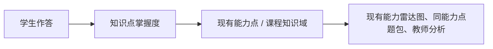
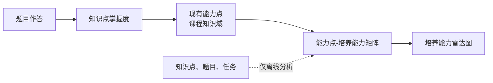

# 基于现有能力点的培养能力映射设计

## 1. 文档目的

系统当前的 `ability_point` 实际承担的是“课程知识域”的职责：它关联多个知识点、用于同能力点题包筛选，并由知识点掌握度聚合为学生能力雷达图。

本设计不替换、不绕过现有能力点，而是在它之上增加一层“培养能力”，用于表达课程希望学生形成的可迁移能力，例如“逻辑推理与算法设计”“调试测试与错误定位”。

核心原则只有一条：

> 新培养能力必须由现有能力点派生；学生任何一次答题都必须先影响知识点，再影响现有能力点，最后才影响培养能力。

## 2. 现有链路与保留范围

当前系统已经有稳定的学习证据链：



其中，现有能力点通过 `ability_knowledge_point` 关联知识点；其得分由关联知识点的掌握度按重要度加权平均得到。精英关“3 道当前知识点 + 2 道同能力点 + 1 道历史薄弱题”中的“同能力点”，也依赖这套映射。

以下内容保持不变：

- 知识点掌握度的渐进更新算法。
- `ability_point` 与 `ability_knowledge_point` 的数据和教师端管理方式。
- 普通关围绕当前知识点出题的规则。
- 精英关的同能力点题包策略。
- 现有能力点的快照、前后雷达图和历史数据。

## 3. 新增后的整体结构



两类能力的职责不同：

| 层级 | 含义 | 系统职责 |
|---|---|---|
| 知识点 | 学生是否掌握某个具体内容 | 答题证据和掌握度计算 |
| 现有能力点 | 某组课程内容上的总体掌握情况 | 课程组织、题包、教师教学分析、能力聚合 |
| 培养能力 | 学生能够完成哪类任务 | 面向学生和教师的高层能力评价 |

现有能力点是中间枢纽，而不是待淘汰的旧数据。

## 4. 培养能力如何产生

系统按课程读取所有现有能力点，以及每个能力点下的知识点、关联题目和学习任务。AI 只在离线生成或教师点击“更新培养能力”时参与，完成两件事：

1. 归纳课程整体的培养能力，建议控制在 `5～10` 个。
2. 判断每个现有能力点分别支撑哪些培养能力，并给出权重与理由。

例如，课程知识域“函数、模块与异常处理能力”下包含函数封装、模块导入、异常捕获等知识点，并关联了代码阅读、异常定位和编程题。AI 可以生成以下关系：

| 现有能力点 | 培养能力 | 权重 | 依据 |
|---|---|---:|---|
| 函数、模块与异常处理能力 | 调试测试与错误定位 | 0.55 | 异常处理和定位错误题提供主要支撑 |
| 函数、模块与异常处理能力 | 代码实现与表达 | 0.30 | 函数封装与模块组织题提供支撑 |
| 函数、模块与异常处理能力 | 抽象设计与综合应用 | 0.15 | 模块化复用题提供补充支撑 |

题目在这里仅作为“生成关系的依据”，不在学生实时答题时直接映射或直接更新培养能力。

## 5. 关系矩阵

设现有能力点集合为：

`A = {a1, a2, ..., am}`

设培养能力集合为：

`C = {c1, c2, ..., cn}`

建立矩阵：

`M ∈ R^(m×n)`

其中 `M[i][j]` 表示现有能力点 `ai` 对培养能力 `cj` 的支撑权重。

矩阵按现有能力点逐行归一化：

`Σj M[i][j] = 1`

这表示一个课程知识域的学习成果会按比例反映到若干培养能力中。列不归一化，因为一个培养能力可以由多个知识域共同培养。

## 6. 离线关系生成算法

### 6.1 输入

对每一个现有能力点，收集：

- 已关联的知识点名称、描述和重要度。
- 这些知识点下的有效题目、题型、题干、标准答案和评分点。
- 已关联的学习任务或课程资源摘要。

### 6.2 AI 输出

AI 返回受限的结构化结果：

- 每个课程的培养能力名称和可观察行为描述。
- 每个现有能力点到培养能力的候选关系。
- 每条关系的建议权重、置信度、支撑题目数和简短理由。

普通课程知识域建议关联 `2～4` 个培养能力，避免一个知识域平均映射到全部能力。

### 6.3 原始权重

对某条“现有能力点 `ai` → 培养能力 `cj`”关系，AI 根据该知识域下题目和任务的综合证据给出原始权重 `raw_weight`。

不要求在运行时保存“题目到培养能力”的逐题映射，也不需要为每次答题调用 AI。

系统只需保存该关系的可解释摘要，例如支撑题目 ID 列表、支撑数量、平均置信度和理由；需要深度审计时再扩展明细表。

## 7. 关系分级与放宽规则

关系生成后分为“正式关联、暂定关联、舍弃”三类。

### 7.1 正式关联

同时满足：

- 支撑题目数不少于 `2`。
- 平均置信度不低于 `0.65`。
- 在该现有能力点所在行的原始权重占比不低于 `0.10`。

正式关联使用原始权重。

### 7.2 暂定关联

满足以下任意条件，并且原始权重行占比不低于 `0.05`：

- 只有 `1` 道支撑题，但置信度不低于 `0.75`。
- 支撑题目数不少于 `2`，平均置信度在 `[0.60, 0.65)`。
- 题量和置信度已满足正式条件，但原始权重行占比在 `[0.05, 0.10)`。

暂定关联不直接删除，但其权重乘以 `0.50` 后再参与归一化。界面上需要明确显示“暂定”，后续增加题目或重新分析后可自动升级为正式关联。

### 7.3 舍弃关联

满足以下任意条件时不进入正式矩阵：

- 平均置信度低于 `0.60`。
- 没有有效支撑题目。
- 原始权重行占比低于 `0.05`。
- 无法给出与知识点、题目或任务相符的理由。

### 7.4 归一化

先根据状态得到调整后权重：

`adjusted_weight = raw_weight × status_factor`

其中正式关联的 `status_factor = 1.0`，暂定关联为 `0.5`。

最终矩阵权重为：

`M[i][j] = adjusted_weight[i][j] / Σk adjusted_weight[i][k]`

如果某个现有能力点没有任何保留关系，标记为“培养能力证据不足”，不伪造平均分配关系。

## 8. 学生得分计算

### 8.1 运行时链路

学生答题后的运行时流程完全复用现有实现：

1. 后端判题并保存答题证据。
2. 按现有公式更新知识点掌握度。
3. 按现有 `ability_knowledge_point` 映射重新聚合受影响的现有能力点。
4. 用这些现有能力点得分和已发布矩阵计算培养能力得分。

不新增题目到培养能力的实时查询，不在答题接口调用 AI，也不增加第二套掌握度更新算法。

### 8.2 培养能力得分公式

设学生在现有能力点 `ai` 上的得分为 `S[i]`，则培养能力 `cj` 的得分为：

`C[j] = Σi(S[i] × M[i][j]) / Σi M[i][j]`

只统计该培养能力存在正式或暂定关系的现有能力点。

这意味着：

- 知识点掌握度仍是唯一原始学习证据。
- 现有能力点仍是唯一的课程内容聚合层。
- 培养能力只是基于现有能力点的二次解释层。

### 8.3 前后雷达图

节点开始时，系统已经保存现有能力点的 `before` 快照；结算后保存 `after` 快照。

培养能力的前后分数由同一份旧能力点快照和同一矩阵版本分别计算：

```text
旧能力点 before 快照 + 冻结矩阵版本 -> 培养能力 before 雷达图
旧能力点 after 快照  + 冻结矩阵版本 -> 培养能力 after 雷达图
```

因此无需在每次评价时再保存一套独立的培养能力分数；只需在评价上下文保存使用的 `matrix_version`。

## 9. 数据结构

为控制实现复杂度，第一阶段只新增两张核心表，并给现有评价上下文补充矩阵版本。

### 9.1 培养能力表 `competency_point`

| 字段 | 说明 |
|---|---|
| `id` | 主键 |
| `course_code` | 课程编码 |
| `name` | 培养能力名称 |
| `description` | 可观察行为描述 |
| `status` | `active/hidden` |
| `matrix_version` | 所属矩阵版本 |
| `created_at` | 创建时间 |

同一课程、同一矩阵版本下，名称唯一。

### 9.2 能力点培养能力关系表 `ability_point_competency_relation`

| 字段 | 说明 |
|---|---|
| `id` | 主键 |
| `course_code` | 课程编码 |
| `ability_point_id` | 现有 `ability_point` 的 ID |
| `competency_id` | 培养能力 ID |
| `raw_weight` | AI 原始权重 |
| `normalized_weight` | 最终矩阵权重 |
| `support_count` | 支撑题目数 |
| `avg_confidence` | 平均置信度 |
| `relation_status` | `formal/provisional` |
| `evidence_summary` | 支撑题目 ID、理由摘要 |
| `matrix_version` | 矩阵版本 |
| `generated_at` | 生成时间 |

唯一约束：

`(course_code, ability_point_id, competency_id, matrix_version)`

### 9.3 版本冻结

在当前评价或爬塔节点的上下文中增加 `competency_matrix_version`。

- 开始评价时，读取课程最新已发布矩阵版本并保存。
- 结算时继续使用该版本。
- 教师重新生成矩阵只影响后续评价，不改变已完成节点的前后雷达图。

不需要在第一阶段增加 `question_competency_mapping`、培养能力独立掌握度表或培养能力快照表。

## 10. 教师端与学生端展示

教师端保留原有的能力点管理页面，并明确其含义为“课程知识域”。新增一个只读或轻编辑的“培养能力映射”页面：

- 展示“现有能力点 × 培养能力”的矩阵。
- 显示正式和暂定状态。
- 点击单元格查看知识点、支撑题目数量和 AI 理由摘要。
- 教师可以修改培养能力名称、隐藏不合适的培养能力，或要求重新生成。
- 教师不需要逐题绑定，也不需要手工填写矩阵权重。

学生端可以分两层展示：

- 学习诊断和关卡内，仍展示当前知识点、课程知识域及其薄弱项。
- 学期或阶段总结中，展示培养能力雷达图，并可下钻到贡献最大的课程知识域。

普通关和精英关的题包规则仍只使用现有能力点，不使用培养能力选题。Boss 或综合评价后续可以参考培养能力，但不属于第一阶段改造范围。

## 11. 实施步骤

### 阶段一：先完成离线矩阵

1. 读取现有能力点、知识点、题目和任务。
2. AI 生成课程培养能力和“现有能力点 → 培养能力”关系。
3. 应用三级关系规则，归一化后发布矩阵版本。
4. 教师端展示矩阵和关系理由。

这一阶段不改学生答题和题包逻辑。

### 阶段二：接入培养能力雷达图

1. 查询现有能力点的当前聚合分数。
2. 按矩阵计算培养能力分数。
3. 节点评价开始时冻结矩阵版本。
4. 基于现有 before/after 快照派生培养能力前后雷达图。

### 阶段三：校准

1. 统计暂定关系升级或被舍弃的比例。
2. 抽样检查 AI 理由是否符合课程和题目实际内容。
3. 根据课程题库规模调整 `0.60/0.65/0.75` 阈值。

## 12. 验收标准

- 现有题包策略、知识点掌握度和能力点得分不因本功能改变。
- 每个培养能力得分均能追溯到一个或多个现有能力点。
- 每个现有能力点到培养能力的关系均可查看支撑题目数和理由。
- 答题接口不新增 AI 调用，也不需要查询题目到培养能力的映射。
- 评价开始和结算使用相同矩阵版本。
- 正式、暂定和舍弃关系符合本设计中的阈值规则。
- 如果没有已发布矩阵，学生端继续展示现有能力点雷达图，不影响答题或关卡。

## 13. 明确不做的事项

- 不删除或重命名数据库中的 `ability_point`。
- 不建立“题目直接更新培养能力”的实时链路。
- 不建立培养能力的第二套掌握度算法。
- 不修改普通关、精英关的知识点和同能力点选题原则。
- 不要求教师手工连接每道题和每个培养能力。
