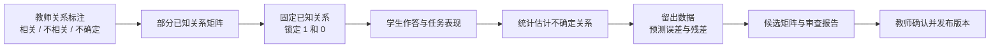

# 能力点映射动态校准设计

> 一句话定位：定义教师部分标注、系统基于学习行为校准的“假能力点 → 真能力点”映射方法。
> 阅读前置：[能力点双层关联矩阵设计](./能力点双层关联矩阵设计.md)、[学生端能力图谱改进方案](../../specs/黄榆航/学生端能力图谱改进方案.md)
> 状态：第一版已实现（候选版本、验证报告、教师发布闭环）

## 1. 设计结论

本设计采用认知诊断领域“部分已知 Q 矩阵”的思想，并将关系存在性与关系强度分开：教师不需要一次性给出完整且精确的映射矩阵，只需对关系标记为“相关”“不相关”或“不确定”；系统固定教师已确认的关系，仅使用学生学习行为数据估计不确定关系，并校准已确认相关关系之间的相对强度。

核心约束如下：

- 教师确认的“相关”关系不可被算法删除。
- 教师确认的“不相关”关系不可被算法加入正式矩阵。
- 算法对“不确定”关系估计是否成立，对“相关”关系校准相对强度。
- 教师确认的“相关”关系可以进入强度校准，但算法不得将其降为“不相关”。
- 算法输出的是候选矩阵和证据，不直接发布生产矩阵。
- API AI 不参与矩阵估计、评分和发布；核心计算由后端统计程序完成。
- 当缺少可观察的任务结果时，系统只能判断映射对学习行为的解释能力，不能宣称证明了真能力定义本身正确。



## 2. 问题定义

现有 `ability_point` 已经由其他流程生成，本设计不重新生成或修改假能力点。

设：

- 假能力点集合为 `A = {a1, a2, ..., am}`；
- 真能力点集合为 `C = {c1, c2, ..., cn}`；
- 关系状态矩阵为 `Q ∈ {1, 0, ?}`；
- 学生在假能力点上的当前分数向量为 `S_u`。

矩阵含义：

| 值 | 教师含义 | 系统含义 |
|---|---|---|
| `1` | 相关 | 固定进入正式映射 |
| `0` | 不相关 | 固定排除 |
| `?` | 不确定 | 允许系统根据数据估计 |

例如：

| 假能力点 | 逻辑构建 | 模块化设计 | 调试纠错 | 数据处理 |
|---|---:|---:|---:|---:|
| Python 基础 | 1 | ? | ? | 0 |
| 函数、模块与异常 | ? | 1 | 1 | 0 |
| 文件与数据处理 | 0 | ? | ? | 1 |

关系状态矩阵 `Q` 只表达关系是否存在；连续强度矩阵 `W` 表达相关关系之间的相对贡献。教师只维护 `Q`，不直接填写 `W`。

```text
W[i][j] = 0                       如果 Q[i][j] = 0
W[i][j] >= 0                      如果 Q[i][j] = 1 或待估计的 ?
Σj W[i][j] = 1                    对每个假能力点归一化
```

如果一个假能力点下有多个相关真能力点，初始强度采用均匀先验。例如两个相关关系初始为 `0.5 / 0.5`。后续由行为数据校准为 `0.65 / 0.35` 等，但教师不直接编辑这些数字。

## 3. 数据来源与前提

系统不要求存在一份完整的“真能力标准答案”，但必须存在可观察的学生行为数据。可使用的数据包括：

- 学生在题目上的正确率和得分；
- 学生在学习任务、实验或项目上的评分；
- 后端判题结果和自动测试结果；
- 学生完成任务后的后续表现；
- 现有知识点掌握度和假能力点聚合分数。

普通知识点题目可以用于估计行为一致性，但综合任务、代码修复、代码重构和项目评分更适合验证高层真能力。

如果当前只有假能力点分数，没有任何能够反映真能力行为的任务结果，则不能从数据中识别“相关”还是“不相关”。此时“不确定”必须继续保持不确定。

为形成这类观测数据，教师可将已有学习任务标记为一个或多个真能力的观测任务。该标记只回答“这个任务是否实际测量该真能力”，不填写任务对能力的数值权重；一个任务关联多个真能力时，系统在校准时分别使用该任务的评分结果。

观测任务关系保存于 `competency_task_observation`，关键字段为：

| 字段 | 含义 |
|---|---|
| `course_code` | 课程编号 |
| `task_no` | 学习任务编号 |
| `competency_id` | 被观测的真能力编号 |
| `status` | `active` 或 `inactive` |

只有任务存在已评分提交时，才进入强度校准样本；没有有效提交的观测标记只作为未来数据入口。

## 4. 估计方法

### 4.1 固定教师已知关系

对每个不确定关系 `Q[i][j] = ?`，分别构造两个候选矩阵：

```text
候选矩阵 Q_yes：将该关系设为 1
候选矩阵 Q_no ：将该关系设为 0
```

教师已知的 `1` 和 `0` 在两个候选矩阵中保持不变。

### 4.2 在相关关系内部估计强度

对同一个假能力点下的相关真能力点，建立强度参数 `W[i][j]`。初始化时采用均匀先验：如果有两个相关真能力点，则分别为 `0.5`；如果有三个，则分别为 `0.333`。

然后在教师确认的关系范围内，通过学生行为数据优化强度：

```text
W* = argmin Loss(实际任务表现, 矩阵预测表现)
```

强度优化必须满足：

- 不相关关系的权重固定为 `0`；
- 相关关系的权重必须大于或等于 `0`；
- 同一假能力点下的权重和为 `1`；
- 新权重不能因单批次少量数据大幅偏离均匀先验或上一版本；
- 相关关系的强度可以下降，但不能因此自动变成不相关。

可使用收缩项避免过拟合：

```text
Loss_total = Loss_prediction
           + λ1 × distance(W, W_previous)
           + λ2 × distance(W, W_uniform_prior)
```

### 4.3 通过学生行为比较候选矩阵

每个候选关系状态和强度矩阵都用于预测学生在后续题目或任务上的表现：

```text
假能力分数 S_u
    → 关系矩阵 Q + 强度矩阵 W
    → 真能力状态 C_u
    → 后续任务预测分数 y_hat
```

分别计算预测分数和实际表现之间的差异：

```text
residual = actual_score - predicted_score
```

可使用的比较指标包括：

- 均方误差或平均绝对误差；
- 二元题目的对数损失；
- 多级评分任务的加权残差；
- 预测排序与实际排序的一致性；
- 模型复杂度惩罚后的 AIC/BIC 或等价指标。

如果 `Q_yes` 在未参与估计的数据上稳定优于 `Q_no`，则输出“数据支持相关”；如果关系已经是相关状态，则比较不同 `W` 的候选值，选择留出数据表现更好的强度区间。

```text
数据支持：相关
```

如果 `Q_no` 更好，则输出：

```text
数据支持：不相关
```

如果差异很小或样本不足，则输出：

```text
数据不足：继续保持不确定
```

### 4.3 关系选择约束

算法不能仅因为预测误差略微下降就改变关系。候选关系需要同时满足：

- 预测效果提升达到设定阈值；
- 在留出数据上仍然成立；
- 不违反教师已确认关系；
- 不造成单个假能力点连接过多真能力点；
- 不造成真能力点完全失去其他来源；
- 在不同学生分组或时间窗口中方向基本一致。

## 5. 数据划分与验证

这里的验证集不是“标注了真能力答案的题目集合”，而是没有参与关系估计的学生行为记录。

建议按学生划分，而不是随机拆分答题记录：

```text
训练数据：用于估计不确定关系
验证数据：用于比较参数、阈值和候选矩阵
测试数据：冻结方案后，检验新矩阵对未见学生的预测能力
```

同一名学生的相邻作答不能同时出现在训练集和测试集，否则会因为学生状态泄漏而高估效果。

当数据量较小时，可使用按学生分组的 K 折交叉验证；当数据量不足以支撑稳定估计时，系统不应自动改变关系。

## 6. 动态校准流程

矩阵校准采用批处理，不在每次学生答题后修改矩阵。

```text
1. 收集新增学习行为数据
2. 读取当前已发布矩阵
3. 只枚举或优化不确定关系
4. 在训练数据上拟合候选矩阵
5. 在验证数据上比较残差和预测效果
6. 检查结构约束和跨批次稳定性
7. 生成候选矩阵与变化报告
8. 教师确认后发布新版本
```

建议按课程或学期进行批量校准。单批次只改变少量关系，并保留旧版本，保证历史评价继续使用原矩阵。

### 6.1 关系状态转换

```text
不确定
  → 数据支持相关
  → 教师确认相关

不确定
  → 数据支持不相关
  → 教师确认不相关
```

“相关”和“不相关”不能由算法直接互相覆盖。算法只能对其提出复核建议。

## 7. 输出报告

每次校准应生成教师可以理解的报告，而不是只返回数字：

| 字段 | 说明 |
|---|---|
| 关系 | 哪个假能力点与哪个真能力点 |
| 当前状态 | 相关 / 不相关 / 不确定 |
| 数据建议 | 支持相关 / 支持不相关 / 数据不足 |
| 预测变化 | 候选矩阵在留出数据上的误差变化 |
| 稳定性 | 不同学生组或时间窗口是否一致 |
| 影响范围 | 哪些真能力分数和页面受到影响 |
| 建议操作 | 接受、保持不确定、拒绝 |

示例：

```text
关系：函数、模块与异常 → 调试纠错
当前状态：不确定
数据建议：支持相关
依据：加入该关系后，后续调试任务预测误差下降 7.4%；
      在 4 个学生分组中有 3 组方向一致。
建议：提交教师复核，不自动发布。
```

当前实现对应的操作流程为：教师点击“生成候选版本”后，系统以当前已发布版本为基础生成新的草稿矩阵；教师查看训练样本、验证样本和方向一致性报告，确认后点击“发布候选版本”。发布前，教师端和学生端仍然读取旧版本；发布后才读取新版本。算法不会自动改变教师维护的关系状态，也不会自动发布候选矩阵。

## 8. 矩阵分数计算

正式矩阵由 `Q` 和 `W` 共同组成。`Q` 决定关系是否进入矩阵，`W` 决定相关关系之间的相对贡献。

例如：

```text
Q：函数模块异常 → 模块化设计 = 相关
Q：函数模块异常 → 调试纠错   = 相关

W：函数模块异常 → 模块化设计 = 0.65
W：函数模块异常 → 调试纠错   = 0.35
```

教师不编辑 `0.65` 和 `0.35`，但可以通过修改 `Q` 来确认、否定或保留关系。数据不足时，系统使用均匀先验并将强度标记为低置信度，不伪造精确结论。

## 9. AI 的边界

本设计的核心估计和验证不调用 API AI。

## 10. 当前接口与实现边界

- `GET /api/ability-competency-map`：读取当前已发布版本；没有历史版本时兼容读取 `v1`。
- `POST /api/ability-competency-map/calibrate`：按学生划分训练集和验证集，生成候选版本及报告，不修改已发布版本。
- `POST /api/ability-competency-map/publish`：教师确认后发布指定候选版本。
- `competency_task_observation`：保存教师对观测任务的标记。
- `ability_competency_matrix_version`：保存候选、已发布和归档版本的生命周期。

第一版的行为校准使用“假能力点当前分数—真能力观测任务成绩”的相关度作为强度依据。它已经具备留出验证和版本隔离，但还不是完整的 Q 矩阵候选比较模型；不确定关系仍不会被算法自动改成相关或不相关。

AI 仅可选用于：

- 将课程材料整理为已有字段；
- 帮助教师生成初始候选关系；
- 将统计报告转换为自然语言说明。

AI 不得：

- 修改教师已确认的关系；
- 根据自然语言直接生成正式矩阵；
- 在学生实时答题链路中参与矩阵校准；
- 将一次 API 输出作为关系正确性的依据。

## 10. 版本与审计

每次发布矩阵都应生成版本号，并记录：

```text
matrix_version
course_code
changed_relations
previous_state
new_candidate_state
training_window
validation_result
teacher_decision
created_at
```

历史学生评价使用开始时冻结的矩阵版本，不因后续校准而重算历史结果。

## 11. 验收标准

- 教师可以把每条关系标记为“相关”“不相关”或“不确定”。
- 算法只改变“不确定”关系，不能覆盖教师已确认关系。
- 系统能使用留出学生行为数据比较候选矩阵。
- 样本不足或候选差异不明显时，关系保持“不确定”。
- 校准结果包含预测误差、残差、稳定性和影响范围。
- 候选矩阵必须由教师确认后才能发布。
- 系统能输出相关关系的强度、置信度和调整前后差异。
- 历史评价可以根据矩阵版本重现原结果。
- 关闭 API AI 后，矩阵估计、验证和发布流程仍可运行。

## 12. 不做

- 不重新生成假能力点。
- 不要求一次性标注完整正确的映射矩阵。
- 不建立依赖 API AI 记忆的学习机制。
- 不让学生单次作答直接修改课程矩阵。
- 不把预测效果提升等同于真能力定义已经被证明正确。
- 不要求教师直接填写连续权重。

## 13. 参考研究

本设计借鉴以下 Q 矩阵研究方向：

1. Wang, Cai, Tu. [Q-Matrix Estimation Methods for Cognitive Diagnosis Models: Based on Partial Known Q-Matrix](https://pubmed.ncbi.nlm.nih.gov/32308032/)。研究在部分 Q 矩阵已知、部分关系未知时，结合学生作答数据估计未知关系。
2. Yu, Cheng. [Data-driven Q-matrix validation using a residual-based statistic in cognitive diagnostic assessment](https://pubmed.ncbi.nlm.nih.gov/31762007/)。研究使用观察表现与模型预期之间的残差验证 Q 矩阵。
3. Li, Mao, Zhang. [Q-matrix estimation (validation) methods for cognitive diagnosis](https://journal.psych.ac.cn/xlkxjz/EN/10.3724/SP.J.1042.2021.02272)。综述 Q 矩阵的参数化、残差和非参数验证方法。
4. Fu et al. [Using Regularized Methods to Validate Q-Matrix in Cognitive Diagnostic Assessment](https://ideas.repec.org/a/sae/jedbes/v50y2025i1p149-179.html)。讨论小样本条件下使用正则化方法减少过度连接和过拟合。
