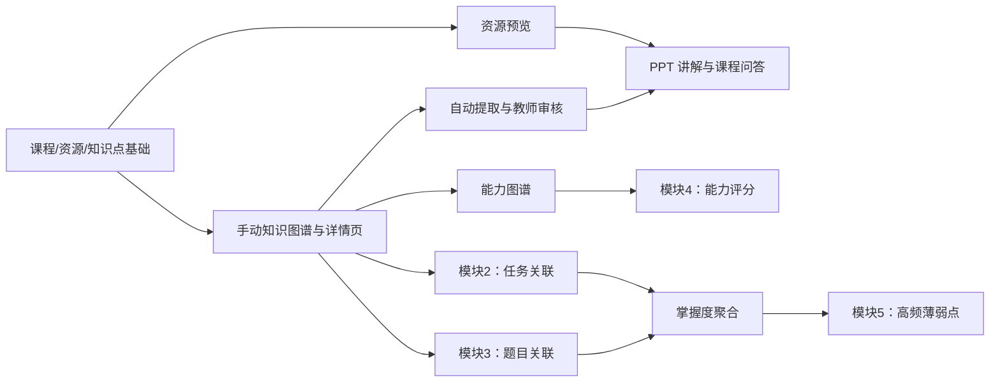

# Plan：课程内容与知识组织模块

> 一句话定位：将课程、资源、知识图谱、能力图谱和课程内智能学习支持分阶段落到现有 Spring Boot/Vue 工程，并稳定服务其余四个模块。
> 阅读前置：[模块1需求](../../specs/党圣航/01-课程内容与知识组织模块需求.md)、[项目需求](../../specs/项目需求.md)、[模块接口与协作规范](../architecture/模块接口与协作规范.md)、[计划写作规范](./plan-writing-guide.md)
> 状态：实施中

## Context（背景）

你（党圣航）负责模块1，它是所有模块的上游：课程编号和知识点编号将被任务、题库、画像、学情分析复用。仓库已存在 `Course`、`Lesson`、文件上传和 Vue 课程页，但尚未提供独立资源、知识点、关系、能力点、智能服务适配或掌握度统计。此计划以不破坏现有课程/课时功能为原则，逐步补齐最新版详细设计说明书第 3.1.1–3.1.12 节的能力。

## Goals（做什么）

- 覆盖模块1需求的 R1–R9；课程、资源、知识点和能力点均有清晰的数据归属和授权入口。
- 先交付不依赖 AI 或下游数据的可用核心路径，再接入智能服务与掌握度聚合。
- 向模块2–5 提供稳定、只读、可 mock 的课程/知识点/能力图谱查询契约。
- 保持现有 `/course`、`/lesson` 的功能可运行；新增接口遵循小组确认后的版本化约定。

## Non-Goals（明确不做）

- 不接管任务、题库、学生、画像、学情分析的数据写入或页面实现。
- 不把 agentic 服务、向量数据库或模型密钥塞进 Spring Boot 模块1。
- 不在未确认转换组件可用的情况下承诺 PPTX/DOCX 的服务端渲染预览。

## 回引规格

- 需求文档：[`../../specs/党圣航/01-课程内容与知识组织模块需求.md`](../../specs/党圣航/01-课程内容与知识组织模块需求.md)
- 设计来源：用户提供的《详细设计说明书》3.1.1–3.1.12；模块协作契约第 4 节。
- 覆盖需求编号：R1.1–R9.2（每项任务逐条回引）。

## 架构决策

- **以现有 Spring Boot 单体为基线增量开发** — 实际仓库已使用 Java 17、Spring Boot、MyBatis-Plus、Session 鉴权和数字型课程编号；不采用协作草案中尚未落地的 FastAPI/UUID/JWT，以避免双栈和破坏兼容性。
- **资源、知识点、关系、能力点独立建模；`Lesson` 仅作为既有课时兼容层** — 一个课程资源可以不等同于一个课时，且一个资源可关联多个知识点。
- **先手动图谱、后自动提取** — 教师审核是正式图谱的唯一写入入口，智能提取结果必须可回退。
- **Agentic 使用端口适配器 + mock** — 先定义请求/响应 DTO 和失败语义，服务未就绪时可完成核心流程和集成测试。
- **掌握度只聚合、不抢数据所有权** — 模块1保存按学生/知识点的聚合结果；模块2/3仍是日志、提交和测评数据唯一写入方。

## 备选方案（Alternatives considered）

| 方案 | 优点 | 为何不选 |
|------|------|---------|
| 迁移为 FastAPI + UUID + JWT | 与旧协作草案一致 | 与现有 Spring Boot 代码、Session 鉴权和数据库主键冲突，迁移风险大且不增加模块1价值。 |
| 继续把所有资源塞进 `Lesson` | 修改最少 | 无法表达多资源、章节/知识点多对多分类、资源级预览和 AI 资料范围。 |
| 自动提取结果直接发布 | 操作步骤少 | 会把模型错误直接写入正式课程结构，无法满足教师审核要求。 |
| 让浏览器直接打开所有 Office 文件 | 开发量低 | 主流浏览器不能可靠预览 PPTX/DOCX，且无法保证跨浏览器体验。 |

## 假设（动笔前亮出，请人先纠正）

1. 课程编号沿用现有数据库自增数字字符串；不在本次模块中强制改为 UUID。
2. `agentic/` 在 Phase 3 前会提供可用的 HTTP 契约；在此之前由 mock 适配器返回固定、可审核的结果。
3. 资源权限暂以“已登录且能访问所属课程”为基础，教师写权限复用 `Auth.canModifyCourse`；选课/班级可见性细则由模块2/5补充。
4. Office 预览采用“保留原件 + 生成 PDF 预览件”的方案；若服务器无可用转换器，则先显示不可预览提示和下载入口。

## 当前执行记录

- 2026-06-23：前端 `npm run build` 通过；存在既有包体积告警，但不阻断构建。
- 2026-06-23：后端本机 Maven 为 3.6.1，无法执行父 POM 选用的编译/测试插件版本；已在 `pom.xml` 显式固定 `maven-compiler-plugin` 3.11.0 和 `maven-surefire-plugin` 3.2.5，随后 `mvn test` 通过（1 个测试）。

## 依赖图

## 任务清单

### 阶段 0：契约确认与可构建基线

- [ ] **T1 — 确认模块1数据与接口兼容策略**（满足 R1.3, R9.1, R9.2）
  - 验收：在协作规范中记录数字型 ID、Spring Boot 基线、新旧路由兼容策略和模块2–5所需只读查询；小组依赖方确认。
  - 验证：评审 `docs/architecture/模块接口与协作规范.md`；列出模块2–5调用样例并获得确认。
  - 依赖：无
  - 文件：`docs/architecture/模块接口与协作规范.md`、`specs/党圣航/01-课程内容与知识组织模块需求.md`
  - 规模：S

- [x] **T2 — 建立模块1迁移与测试基线**（满足 R1.1–R1.4）
  - 验收：后端 `mvn test` 与前端构建均通过；已记录 Maven 插件兼容修复、当前课程/课时接口与数据库迁移起点。
  - 验证：`cd backend && mvn test`；`cd frontend && npm run build`
  - 依赖：T1
  - 文件：`backend/pom.xml`、`backend/src/test/`、`backend/src/main/resources/schema.sql`、`docs/plans/module1-课程内容与知识组织.plan.md`
  - 规模：S

### 🔍 检查点：阶段 0 完成

- [ ] 技术基线、ID 策略、权限策略与路由版本策略已获小组确认。
- [ ] 后端测试和前端构建均可执行。

### 阶段 1：课程与知识结构地基

- [x] **T3 — 扩展课程信息并保留课程 CRUD 兼容性**（满足 R1.1–R1.4）
  - 验收：课程可维护简介、适用专业和课程目标；原课程列表、详情、创建和编辑路径不回归；非法学分/学时与越权删除被拒绝。
  - 验证：`cd backend && mvn test -Dtest=CourseControllerTest`（3 项通过）；`cd frontend && npm run build` 通过。
  - 依赖：T2
  - 文件：`backend/pom.xml`、`backend/.../entity/Course.java`、`backend/.../controller/CourseController.java`、`backend/src/main/resources/schema.sql`、`frontend/src/views/CourseManage.vue`、`backend/src/test/.../CourseControllerTest.java`
  - 规模：M

- [x] **T4 — 实现知识点的课程内 CRUD 与查询契约**（满足 R3.1, R9.1）
  - 验收：教师可创建、编辑、删除、按课程/章节查询知识点；跨课程移动、无效重要程度与无权课程写入会被拒绝；其他模块可按课程读取稳定的知识点列表。
  - 验证：`cd backend && mvn test -Dtest=KnowledgePointControllerTest`（4 项通过）；`cd backend && mvn test`（8 项通过）。
  - 依赖：T3
  - 文件：`backend/.../entity/KnowledgePoint.java`、`backend/.../controller/KnowledgePointController.java`、`backend/.../service/KnowledgePointService.java`、`backend/.../mapper/KnowledgePointMapper.java`、`backend/src/main/resources/schema.sql`、`backend/src/test/.../KnowledgePointControllerTest.java`
  - 规模：M

- [x] **T5 — 实现关系校验、知识树和前置链查询**（满足 R3.2–R3.4, R9.1）
  - 验收：可维护 hierarchy、prerequisite、related 三类边；自关联、重复边、跨课程关系和层级/前置有向环会被拒绝；可返回知识树、图谱节点边与完整前置链。
  - 验证：`cd backend && mvn test '-Dtest=KnowledgePointControllerTest,KnowledgeRelationControllerTest'`（9 项通过）；`cd backend && mvn test`（13 项通过）。
  - 依赖：T4
  - 文件：`backend/.../entity/KnowledgeRelation.java`、`backend/.../controller/KnowledgeRelationController.java`、`backend/.../controller/KnowledgePointController.java`、`backend/.../service/KnowledgeRelationService.java`、`backend/src/main/resources/schema.sql`、`backend/src/test/.../KnowledgeRelationControllerTest.java`
  - 规模：L

### 🔍 检查点：阶段 1 完成

- [ ] 教师可维护一个课程的知识点和三类关系，学生可读取结构。
- [ ] 课程、知识点、前置链三项对外查询契约已以集成测试锁定。
- [ ] `mvn test` 全量通过。

### 阶段 2：资源与学习页面核心路径

- [x] **T6 — 建立独立课程资源模型与授权管理**（满足 R2.1, R2.2, R2.4）
  - 验收：资源记录课程、标题、类型、章节、关联知识点、上传者和文件路径；支持按课程/章节/知识点/类型筛选、重命名、重分类和删除；非法类型、超过 10MB、跨课程知识点和越权操作会被拒绝。
  - 验证：`cd backend && mvn test -Dtest=CourseResourceControllerTest`（4 项通过）；`cd backend && mvn test`（17 项通过）。
  - 依赖：T3
  - 文件：`backend/.../entity/CourseResource.java`、`backend/.../controller/CourseResourceController.java`、`backend/.../service/CourseResourceService.java`、`backend/.../service/FileStorageServiceImpl.java`、`backend/src/main/resources/schema.sql`、`backend/src/test/.../CourseResourceControllerTest.java`
  - 规模：L

- [x] **T7 — 交付资源列表、下载、分类型预览与浏览事件对接**（满足 R2.3）
  - 验收：PDF、视频、图片、文本可在浏览器内预览；PPT/Word 显示下载入口与明确提示；课程资源改存私有目录并只能经登录后的内容接口读取；学生浏览开始/结束时发布 `ResourceViewEvent`，不直接写模块2数据表。
  - 验证：`cd backend && mvn test -Dtest=CourseResourceControllerTest`（5 项通过）；`cd backend && mvn test`（18 项通过）；`cd frontend && npm run build` 通过。
  - 依赖：T6
  - 文件：`backend/.../controller/CourseResourceController.java`、`backend/.../service/FileStorageService*`、`backend/.../common/event/ResourceViewEvent.java`、`frontend/src/views/CourseResourceList.vue`、`frontend/src/views/CourseResourcePreview.vue`、`frontend/src/api/index.js`
  - 规模：L

- [x] **T8 — 实现 Office 预览件生成或受控降级**（满足 R2.3）
  - 验收：部署 LibreOffice 并开启配置时，可将 PPTX/DOCX 转换为私有 PDF 预览件并保留原件；转换失败或服务未配置时资源标记为 `failed`/`unavailable`，前端保留下载入口且不阻塞上传。
  - 验证：`cd backend && mvn test -Dtest=CourseResourceControllerTest`（6 项通过，覆盖未配置转换器的降级状态）；`cd backend && mvn test`（19 项通过）。当前开发机未安装 LibreOffice，真实转换待部署环境验证。
  - 依赖：T6
  - 文件：`backend/.../service/OfficePreviewService.java`、`backend/.../service/impl/OfficePreviewServiceImpl.java`、`backend/.../controller/CourseResourceController.java`、`backend/src/main/resources/application.yml`、`backend/src/main/resources/schema.sql`
  - 规模：M

- [ ] **T9 — 交付知识图谱浏览和知识点详情页**（满足 R4.1, R4.2）
  - 验收：学生可在图谱点击节点进入详情；详情展示知识关系与资源，任务/练习未接入时显示空状态；教师可从页面跳转到编辑。
  - 验证：`cd frontend && npm run build`；手工测试“课程 → 图谱 → 知识点详情 → 资源预览”路径。
  - 依赖：T5, T7
  - 文件：`frontend/src/views/KnowledgeGraph.vue`、`frontend/src/views/KnowledgePointDetail.vue`、`frontend/src/components/KnowledgeGraphCanvas.vue`、`frontend/src/router/index.js`、`frontend/src/api/index.js`
  - 规模：L

### 🔍 检查点：阶段 2 完成

- [ ] 非 AI 核心路径可端到端演示：课程 → 上传/分类资源 → 构建图谱 → 知识点详情 → 预览资源。
- [ ] 资源与图谱的授权、非法输入、空数据状态均已验证。
- [ ] Office 预览策略及运行环境已记录；未满足时明确以降级方式交付。

### 阶段 3：能力图谱与跨模块统计接口

- [ ] **T10 — 构建课程能力点及知识点映射管理**（满足 R7.1, R7.2, R9.1）
  - 验收：教师可增改能力点和知识点映射；可按课程查询能力图谱；模块4可只读获取能力点与映射。
  - 验证：`cd backend && mvn test -Dtest=AbilityMap*Test`；Postman 验证映射 CRUD 和模块4查询样例。
  - 依赖：T4
  - 文件：`backend/.../course/ability/`、`backend/src/main/resources/schema.sql`、`backend/src/main/resources/mapper/`
  - 规模：M

- [ ] **T11 — 定义并实现掌握度聚合输入与查询**（满足 R8.1, R8.3, R9.2）
  - 验收：可接收/拉取模块2、3带知识点标识的标准化结果并保存可追溯聚合；无数据时返回空/数据不足；不直接写模块2/3表。
  - 验证：`cd backend && mvn test -Dtest=KnowledgeMastery*Test`；使用模块2/3 mock 事件验证幂等更新和空数据。
  - 依赖：T4, T10
  - 文件：`backend/.../course/mastery/`、`backend/.../course/`、`backend/src/main/resources/schema.sql`、`docs/architecture/模块接口与协作规范.md`
  - 规模：L

- [ ] **T12 — 发布高频薄弱知识点排名接口**（满足 R8.2, R8.3）
  - 验收：按课程返回排名、低掌握度/错误率/重复观看/提问等统计依据；可按接入数据逐项启用；没有任何数据时不制造排名。
  - 验证：`cd backend && mvn test -Dtest=WeakPoint*Test`；模块5 mock 调用并核对排序和空结果。
  - 依赖：T11
  - 文件：`backend/.../course/mastery/`、`backend/.../controller/`、`backend/src/main/resources/mapper/`
  - 规模：M

### 🔍 检查点：阶段 3 完成

- [ ] 模块3可按知识点关联题目，模块4可读取能力图谱，模块5可读取薄弱点；未就绪依赖均有 mock/空状态。
- [ ] 聚合数据的来源、更新时间和计算依据可追溯。

### 阶段 4：AI 智能能力

- [ ] **T13 — 建立 agentic 适配器、DTO 和可控 mock**（满足 R5.1, R5.3, R6.1–R6.3）
  - 验收：定义提取、讲解、问答的请求/响应与超时/失败语义；可在 mock 与真实服务之间切换；不在日志或响应中泄露密钥。
  - 验证：`cd backend && mvn test -Dtest=Agentic*Test`；分别运行 mock 成功、超时、无效响应测试。
  - 依赖：T6
  - 文件：`backend/.../agentic/`、`backend/src/main/resources/application.yml`、`backend/.../course/`
  - 规模：M

- [ ] **T14 — 实现知识点提取候选与教师审核发布**（满足 R5.1–R5.3）
  - 验收：教师可从已上传资料创建候选提取任务、查看候选、接受/编辑/拒绝；只有接受后写入正式知识点和关系；失败不改正式图谱。
  - 验证：`cd backend && mvn test -Dtest=KnowledgeExtraction*Test`；手工验证“提取 → 修改候选 → 接受 → 图谱更新”和失败回滚。
  - 依赖：T5, T6, T13
  - 文件：`backend/.../course/extraction/`、`backend/.../course/knowledge/`、`frontend/src/views/KnowledgeExtractionReview.vue`、`frontend/src/api/index.js`
  - 规模：L

- [ ] **T15 — 实现 PPT 知识点讲解与同上下文追问**（满足 R6.1, R6.3）
  - 验收：学生可从已授权 PPT/知识点发起包含页码上下文的讲解，并在相同资源与知识点范围内继续追问；返回解释、重点、误区和示例；无权限或资料不足时安全失败。
  - 验证：`cd backend && mvn test -Dtest=Lecture*Test`；在资源预览页手工验证成功、无权和无页码三种路径。
  - 依赖：T7, T9, T13
  - 文件：`backend/.../course/lecture/`、`frontend/src/components/LecturePanel.vue`、`frontend/src/views/ResourcePreview.vue`、`frontend/src/api/index.js`
  - 规模：M

- [ ] **T16 — 实现基于课程资料的知识点问答**（满足 R6.2, R6.3）
  - 验收：问答请求带课程/知识点/资源范围；回答返回来源或资料不足；跨课程资料和未授权资源不会进入上下文。
  - 验证：`cd backend && mvn test -Dtest=CourseQa*Test`；手工测试同课程回答、无资料和跨课程越权三种路径。
  - 依赖：T9, T13
  - 文件：`backend/.../course/qa/`、`frontend/src/components/CourseQaPanel.vue`、`frontend/src/views/KnowledgePointDetail.vue`、`frontend/src/api/index.js`
  - 规模：M

- [ ] **T17 — 实现能力图谱智能草案与人工编辑**（满足 R7.1, R7.2）
  - 验收：教师可从正式知识点生成能力点草案、编辑后发布；发布后模块4读取到稳定版本；智能服务失败不覆盖正式能力图谱。
  - 验证：`cd backend && mvn test -Dtest=AbilityGraphGeneration*Test`；mock 成功和失败路径各一条。
  - 依赖：T10, T13
  - 文件：`backend/.../course/ability/`、`backend/.../agentic/`、`frontend/src/views/AbilityMapManage.vue`、`frontend/src/api/index.js`
  - 规模：M

### 🔍 检查点：阶段 4 完成

- [ ] 三项 AI 能力均有成功、超时/失败和权限边界测试。
- [ ] 所有自动生成内容均须教师审核或显示资料来源，且不会污染正式数据。
- [ ] agentic 实现可替换，核心课程与图谱功能不依赖其在线可用。

### 阶段 5：联调与交付

- [ ] **T18 — 完成模块2–5契约联调与回归测试**（满足 R8.1–R9.2）
  - 验收：模块2/3数据可驱动掌握度，模块4读取能力图谱，模块5读取薄弱点；原有课程/课时接口仍可使用。
  - 验证：`cd backend && mvn test`；运行跨模块 Postman 集合；`cd frontend && npm run build`。
  - 依赖：T12, T14–T17及模块2–5对应接口
  - 文件：`backend/src/test/`、`frontend/src/`、`docs/architecture/模块接口与协作规范.md`、`references/ITERATION_LOG.md`
  - 规模：L

- [ ] **T19 — 完成演示数据、操作说明和验收记录**（满足 R1.1–R9.2）
  - 验收：提供一个 Python 编程与数据分析课程的可演示资源、图谱、能力图谱和测试数据；教师/学生演示步骤可复现；已知限制被如实记录。
  - 验证：新环境按说明执行建表、启动后端/前端并完成端到端演示。
  - 依赖：T18
  - 文件：`backend/src/main/resources/data.sql`、`README.md`、`references/ITERATION_LOG.md`、`docs/plans/module1-课程内容与知识组织.plan.md`
  - 规模：M

### 🔍 检查点：阶段 5 完成

- [ ] 全部模块1任务勾选完成，后端全量测试与前端构建通过。
- [ ] 模块2–5依赖接口联调通过，接口变更已通知并写入协作规范。
- [ ] 人审通过后将本计划标记为“已完成”。

## 风险与缓解

| 风险 | 影响 | 缓解 |
|------|------|------|
| 协作规范与现有工程在框架、鉴权、ID 上冲突 | 高 | T1 先定实际基线并更新契约；不要混用 FastAPI/UUID 草案和 Spring Boot 代码。 |
| `agentic` 服务尚为空目录，接口未定 | 高 | T13 先锁 DTO、超时与 mock；AI 功能在服务就绪后切换真实适配器。 |
| PPTX/DOCX 不能被浏览器稳定预览 | 中 | T8 先验证转换器；失败时合法降级为下载并记录限制。 |
| 知识点关系存在环或跨课程污染 | 高 | T5 在写入事务中做课程一致性和有向环检测，测试覆盖异常路径。 |
| 掌握度所依赖的下游数据未就绪 | 中 | T11/T12 使用标准化 mock 和空状态；不伪造学习统计。 |
| 现有 `Lesson` 与新 `Resource` 语义重叠 | 中 | 保留旧接口，明确课时是课程组织单元、资源是可独立分类和关联的文件实体；迁移另行评审。 |

## Open Questions（需人拍板）

1. 课程资源的最大大小、允许 MIME 类型和视频时长限制是多少？
2. Office 文档预览可否部署 LibreOffice/OnlyOffice 转换组件？若不可以，是否接受下载降级？
3. `agentic` 的真实 HTTP 路由、鉴权方式、响应 JSON、超时和费用限制是什么？
4. 课程资源的学生可见性是否以选课/班级为准；相应选课关系由哪个模块拥有？
5. 掌握度公式中任务、测验、观看、提问的权重由谁确认？本计划只建立可追溯聚合接口，不擅自固定教学权重。
6. 团队是否确认以当前 Spring Boot + Session + 数字型 ID 为实现基线，并更新旧协作草案？

## 越权红线（THE PLAN SHALL NOT …）

- 不未经小组同意改用另一套后端框架、鉴权机制或主键体系。
- 不直接修改模块2–5拥有的数据表，或以临时 SQL 伪造其业务数据。
- 不将模型密钥写入前端、仓库或日志；不绕过 agentic 服务调用模型。
- 不让自动提取或自动生成的关系直接覆盖已审核的课程知识结构。
- 不为追求演示效果伪造学生掌握度、薄弱点或智能回答来源。

## 完成定义（DoD）

- [ ] R1.1–R9.2 全部被至少一项测试或端到端步骤覆盖。
- [ ] 教师可完成课程/资源/知识点/关系/能力点维护；学生可完成课程结构浏览、详情和授权资源预览。
- [ ] 自动提取、讲解、问答具备 mock 与真实服务的可替换适配、权限控制和失败处理。
- [ ] 模块2–5可按契约读取模块1数据；掌握度和薄弱点的空状态、真实数据和来源可验证。
- [ ] `cd backend && mvn test`、`cd frontend && npm run build` 均通过，跨模块 Postman 集合无阻断性失败。
- [ ] 更新协作规范、迭代日志及本计划状态；由小组人审确认后进入实现。

## 端到端验证

1. 管理员/教师创建或编辑课程，上传 PDF、视频和 Office 资源，按章节及知识点分类。
2. 教师创建知识点与关系，验证非法环被拒绝；学生从课程结构进入图谱和知识点详情并预览授权资源。
3. 通过 mock agentic 对一份资源提取候选知识点，教师编辑并接受；确认正式图谱更新，失败案例不修改正式图谱。
4. 在 PPT/知识点详情发起讲解和问答，核对资料范围、来源/资料不足提示及越权拒绝。
5. 注入模块2/3测试结果，查询学生掌握度与课程薄弱点；由模块4读取能力图谱、模块5读取薄弱点排名。
