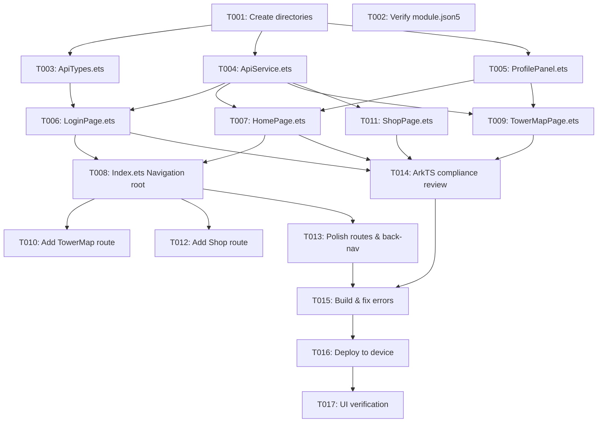

# Tasks: 爬塔错题商店（鸿蒙学生端）

**Input**: Design documents from `spec/climbing-tower-shop/`
**Prerequisites**: plan.md (✅), spec.md (✅)

**Tests**: 无测试任务（spec 未要求 TDD）

**Organization**: 按用户故事分组，每个故事可独立实现和验证

## Format: `[ID] [P?] [Story] Description`

- **[P]**: 可并行执行（操作不同文件，无依赖）
- **[Story]**: 所属用户故事（US1/US2/US3），仅用户故事阶段使用

---

## Phase 1: Setup（共享基础设施）

**Purpose**: 创建目录结构

- [X] T001 Create service/ and components/ directories under entry/src/main/ets/
- [X] T002 [P] Verify module.json5 already has ohos.permission.INTERNET and deviceTypes include phone/tablet/2in1

---

## Phase 2: Foundational（阻塞性前提）

**Purpose**: 所有用户故事都依赖的共享模块，必须先完成

**⚠️ CRITICAL**: 必须完成此阶段才能开始任何用户故事

- [X] T003 [P] Create ApiTypes.ets with all interface definitions (LoginBody, StudentProfile, TowerNode, MistakeItem, GameEventBody, ApiResponse) in entry/src/main/ets/service/ApiTypes.ets
- [X] T004 [P] Create ApiService.ets as static class extracting HTTP logic from current Index.ets (setBaseUrl, getBaseUrl, getCookie, buildHeaders, saveCookie, get, post, formatResult) using AppStorage for baseUrl/cookie in entry/src/main/ets/service/ApiService.ets
- [X] T005 [P] Create ProfilePanel.ets as @Component with @Prop inputs (hp, maxHp, attack, defense, exp, coins) rendering horizontal Row of stat labels in entry/src/main/ets/components/ProfilePanel.ets

**Checkpoint**: 共享模块就绪——ApiService 可被任何页面调用，ProfilePanel 可被任何页面嵌入

---

## Phase 3: User Story 1 - 学生登录并进入爬塔 (Priority: P1) 🎯 MVP

**Goal**: 学生从登录页输入凭证 → 登录成功 → 首页看到画像 → 进入爬塔按钮可用

**Independent Test**: 启动 App → 输入后端地址+账号+密码 → 点击登录 → 看到首页画像数值（HP/ATK/DEF/EXP/Coins）→ 点击"进入爬塔"按钮有跳转意图

### Implementation for User Story 1

- [X] T006 [P] [US1] Create LoginPage.ets with baseUrl/username/password/courseId inputs, login button calling ApiService.post('/api/students/login'), on success write studentNo/courseId to AppStorage and pushPathByName('Home') in entry/src/main/ets/pages/LoginPage.ets
- [X] T007 [US1] Create HomePage.ets with aboutToAppear calling ApiService.get profile endpoint, rendering welcome text + ProfilePanel component + "进入爬塔" button that pushesPathByName('TowerMap') in entry/src/main/ets/pages/HomePage.ets
- [X] T008 [US1] Rewrite Index.ets as @Entry Navigation root: declare @Provide navPathStack, build() returns Navigation with initial LoginPage, @Builder navDestination pageMap routes 'Home' to HomePage in entry/src/main/ets/pages/Index.ets

**Checkpoint**: 登录 → 首页链路完全可用，画像面板正常渲染

---

## Phase 4: User Story 2 - 查看爬塔地图并定位商店节点 (Priority: P2)

**Goal**: 学生从首页点击"进入爬塔" → 爬塔地图页展示楼层节点列表 → 商店节点可点击

**Independent Test**: 首页点击"进入爬塔" → 地图页加载节点列表 → 每个节点显示名称/楼层/类型标签 → 商店节点颜色突出可点击 → 其他节点点击无响应

### Implementation for User Story 2

- [X] T009 [P] [US2] Create TowerMapPage.ets with aboutToAppear calling ApiService.get tower-map endpoint, parse node array, render Scroll+Column of node cards (each showing floor+name+roomType label), shop nodes clickable to pushPathByName('Shop', nodeData), non-shop nodes show greyed/inactive style, top area embeds ProfilePanel in entry/src/main/ets/pages/TowerMapPage.ets
- [X] T010 [US2] Update Index.ets @Builder pageMap to add 'TowerMap' → TowerMapPage() route

**Checkpoint**: 地图页正常展示，商店节点可识别且可点击

---

## Phase 5: User Story 3 - 进入错题商店并执行操作 (Priority: P3)

**Goal**: 学生点击商店节点 → 错题商店页展示错题列表+金币余额 → 可执行购买提示卡/净化错题卡操作

**Independent Test**: 地图页点击商店节点 → 商店页显示金币余额+错题列表（≤5条）→ 金币 ≥ 10 可点购买 → 金币 ≥ 8 且有错题可点净化 → 操作成功后按钮变灰 → 金币不足时按钮置灰

### Implementation for User Story 3

- [X] T011 [P] [US3] Create ShopPage.ets with aboutToAppear calling ApiService.get mistakes endpoint, rendering coin balance at top, mistake list (up to 5 items with index+stem), two action buttons (buy hint 10 coins / cleanse wrong card 8 coins) with coin-gating logic, on successful action call ApiService.post game-event endpoint (event_type: 'shop_purchased') and disable button, show error state for empty mistakes list in entry/src/main/ets/pages/ShopPage.ets
- [X] T012 [US3] Update Index.ets @Builder pageMap to add 'Shop' → ShopPage() route

**Checkpoint**: 错题商店完整可用——错题展示、金币判断、操作反馈全部正常

---

## Phase 6: Polish（跨页面打磨）

**Purpose**: 导航完整性、ArkTS 合规检查、错误处理一致性

- [X] T013 [P] Review and finalize all navDestination routes in Index.ets — ensure back-navigation works for all pages, page titles are set properly
- [X] T014 [P] Review all .ets files for ArkTS compliance: no bracket notation for object props, no `as` assertions (except navDestination builder), no template literals, no catch type annotations

---

## Phase 7: Verification

<!-- verification_scope: build+ui -->

**Purpose**: 构建、部署并 UI 验证已实现的功能

- [ ] T015 Build project and fix any compilation errors — invoke build_project; iterate fix → build until BUILD SUCCESSFUL with zero ERROR/WARN
- [ ] T016 Deploy application to device/emulator — invoke start_app to verify the app launches without crash
- [ ] T017 Run UI verification against deployed application — invoke verify_ui to check each user story page renders correctly

---

## 📊 Dependency Graph

---

## ⚡ Parallel Execution Guide

| Phase | Tasks | Required Files | Execution Notes |
|-------|-------|---------------|-----------------|
| Setup | T001, T002 | none | 仅创建目录 + 验证已有文件，可并行 |
| Foundational | T003, T004, T005 | ApiTypes/ApiService/ProfilePanel | 操作不同文件，可并行 |
| US1 | T006 | T003, T004 | LoginPage 依赖 ApiService + ApiTypes |
| US1 | T007, T008 | T004, T005, T006 | HomePage 依赖 ProfilePanel；Index 依赖已有页面 |
| US2 | T009, T010 | T004, T005, T008 | TowerMapPage 依赖 ApiService + ProfilePanel + Index 路由 |
| US3 | T011, T012 | T004, T008 | ShopPage 依赖 ApiService + Index 路由 |
| Polish | T013, T014 | 所有已完成代码 | 并行审查 |
| Verification | T015 → T016 → T017 | 全部 | 严格串行（构建→部署→UI验证） |

---

## Implementation Strategy

### MVP First（仅 User Story 1）

1. T001-T002: Setup
2. T003-T005: Foundational（共享模块）
3. T006-T008: User Story 1（登录+首页）
4. **STOP**: build_project → start_app → 验证登录→首页链路
5. 可交付 MVP

### Incremental Delivery

1. Setup + Foundational → 共享层就绪
2. User Story 1 → 登录+首页 ✅ （MVP!）
3. User Story 2 → 地图页 ✅ （增量）
4. User Story 3 → 商店页 ✅ （完整功能）
5. Polish → 打磨
6. Verification → 最终验证

---

## Summary

| 指标 | 数值 |
|------|------|
| 总任务数 | 17 |
| User Story 1 (P1) 任务 | 3 (T006-T008) |
| User Story 2 (P2) 任务 | 2 (T009-T010) |
| User Story 3 (P3) 任务 | 2 (T011-T012) |
| Setup 任务 | 2 (T001-T002) |
| Foundational 任务 | 3 (T003-T005) |
| Polish 任务 | 2 (T013-T014) |
| Verification 任务 | 3 (T015-T017) |
| 可并行任务 | 10 个标记 [P] |
| 新建文件 | 7 (.ets) |
| 重写文件 | 1 (Index.ets) |
| 验证范围 | build + deploy + UI verification |
