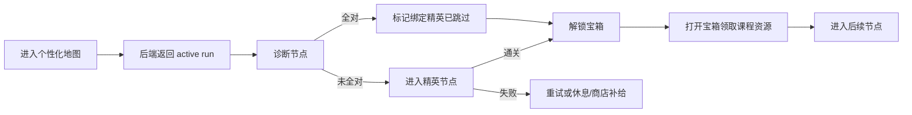

# 地图节点完整性与中文异步结算修复计划

> 一句话定位：把爬塔地图节点完整性、精英/诊断/宝箱解锁、课程资源宝箱、中文界面、诊断报告和跳转卡顿问题合并成一份可执行修复计划。
> 阅读前置：[03-个性化爬塔路线与通关解锁实施计划](./03-个性化爬塔路线与通关解锁实施计划.md)、[04-爬塔体验与个性化题包二期改进计划](./04-爬塔体验与个性化题包二期改进计划.md)、[05-诊断奖励异步与题包真实化修复计划](./05-诊断奖励异步与题包真实化修复计划.md)、[../common/authoring-conventions.md](../common/authoring-conventions.md)
> 状态：草拟

---

## 1. 背景

当前爬塔体验同时暴露了两类问题：

| 问题组 | 现象 | 影响 |
|------|------|------|
| 地图规则 | 个性化地图不保证包含诊断、精英、商店、休息点、宝箱；精英通关或诊断跳过后没有稳定解锁宝箱 | 路线缺少完整游戏循环，课程资源奖励无法落地 |
| 前端体验 | 页面出现英文、乱码、`???`；战斗成功后诊断结果缺失；诊断房/战斗房最后一题后跳转卡顿 | 用户无法确认学习结果，流程像是卡死 |

本计划在已有 `run/node/question-pack/ability-radar` 方案上补齐硬规则：

1. 每个学生生成的地图必须包含诊断、精英、商店、休息点、宝箱。
2. 每个精英节点必须绑定一个宝箱节点。
3. 当学生通过精英怪，或通过诊断房直接跳过该精英怪时，系统必须解锁对应宝箱。
4. 宝箱必须承载课程资源，例如视频、文档、链接、练习材料。
5. AI 诊断报告和能力图谱生成不允许阻塞页面跳转。
6. 前端所有学习流程界面必须保持中文，不出现乱码、英文占位和 `???`。

## 2. 目标

| 编号 | 目标 | 可检验结果 |
|------|------|------------|
| G1 | 地图节点完整 | 新生成的每条 active run 至少包含 `diagnosis/elite/shop/rest/treasure` 五类节点 |
| G2 | 精英宝箱绑定 | 每个 elite 节点有且只有一个默认绑定 treasure 节点 |
| G3 | 宝箱解锁正确 | 精英通关或诊断完美跳过精英后，对应宝箱从 `locked` 变为 `available` |
| G4 | 宝箱有课程资源 | 打开宝箱时展示至少 1 个可访问课程资源；题库/资源缺失时显示中文兜底状态 |
| G5 | 中文界面 | 核心爬塔流程中不出现未翻译英文、乱码、`???` |
| G6 | 诊断结果不断档 | 战斗成功通关后结算页始终有诊断结果区域；AI 未返回时显示“诊断结果生成中” |
| G7 | 跳转不卡顿 | 诊断最后一题到战斗/奖励、战斗最后一题到结算，前端状态切换不等待 AI 报告或能力图谱 |

## 3. 总体流程

关键原则：

- 地图事实源在后端，前端不再根据下标自行拼出房间类型。
- 节点状态推进以 `runId + nodeId` 为准，不以知识点 ID 代替节点 ID。
- 页面跳转只等待必要的本地判定和后端最小状态确认；AI 报告、能力雷达、诊断说明都异步补齐。
- 任何异步内容未返回时，页面必须显示中文 loading 或兜底，不允许空白、英文或乱码。

## 4. 功能需求

### R1 组：地图节点与路线完整性

**R1.1** 系统应为每个学生每门课程生成 active run，且该 run 中至少包含一个诊断节点、一个精英节点、一个商店节点、一个休息点节点和一个宝箱节点。

**R1.2** 当系统生成 elite 节点时，系统应同时生成一个与该 elite 节点绑定的 treasure 节点。

**R1.3** 系统应将新生成的 treasure 节点初始状态设置为 `locked`，并记录其绑定的 elite 节点 ID。

**R1.4** 当前端请求地图时，系统应返回每个节点的 `runId`、`nodeId`、`roomType`、`status`、`parentNodeId`、`unlockAfterNodeId` 和中文展示名。

**R1.5** 如果 AI 路线生成结果缺少诊断、精英、商店、休息点或宝箱任一类型，则系统应使用规则补齐缺失节点后再落库。

**R1.6** 如果 AI 路线生成失败或超时，则系统应使用规则模板生成包含完整节点类型的路线。

**R1.7** 前端不应通过数组下标、固定 `roomPattern` 或本地随机逻辑决定地图节点类型。

### R2 组：精英、诊断与宝箱解锁

**R2.1** 当学生通关 elite 节点时，系统应将该 elite 节点标记为 `cleared`，并将绑定 treasure 节点标记为 `available`。

**R2.2** 当学生在绑定诊断节点中全部答对时，系统应允许直接跳过对应 elite 节点，并将该 elite 节点记录为 `cleared_by_diagnosis`。

**R2.3** 当学生通过诊断房跳过 elite 节点时，系统应解锁与该 elite 节点绑定的 treasure 节点。

**R2.4** 当学生未全部答对诊断题时，系统不应解锁绑定 treasure 节点，也不应将 elite 节点视为通关。

**R2.5** 当 treasure 节点已解锁但未领取时，前端应展示“可开启”；当已领取时，前端应展示“已领取”。

**R2.6** 如果学生重复进入已领取 treasure 节点，则系统应展示已领取资源记录，不应重复发放一次性奖励。

### R3 组：宝箱课程资源

**R3.1** 系统应在 treasure 节点中放置与当前课程、知识点或能力点相关的课程资源。

**R3.2** 宝箱资源应支持视频、文档、外链、课件、练习材料等类型，并返回中文资源类型名称。

**R3.3** 当学生开启宝箱时，系统应记录资源领取记录，包含 `studentNo`、`courseCode`、`runId`、`nodeId`、`resourceId`、`openedAt`。

**R3.4** 如果当前知识点没有可用资源，则系统应扩展到同课程资源；如果同课程也没有资源，则前端应显示“课程资源待配置”，不应显示空白或乱码。

**R3.5** 宝箱资源不应只在前端写死；应来自后端课程资源数据或后端统一兜底数据。

### R4 组：中文界面与乱码修复

**R4.1** 系统应在爬塔地图、诊断房、战斗房、奖励页、结算页、宝箱页中使用中文界面文案。

**R4.2** 如果后端字段为空或未返回翻译，前端应使用中文兜底文案。

**R4.3** 前端不应在用户可见区域显示 `BATTLE ROOM`、`SETTLEMENT`、`RUN REPORT`、`Node Intel`、`Diagnosis Result`、`AI Tutor`、`Supply` 等英文文案。

**R4.4** 前端不应在用户可见区域显示 `???`、`????`、乱码字符或由编码错误产生的占位文本。

**R4.5** 所有新增或修改的前端源文件应保存为 UTF-8 编码。

**R4.6** 课程名、编程语言名、代码片段、API 名称等本身需要保留英文的内容可以保留英文。

### R5 组：诊断结果与能力图谱异步补齐

**R5.1** 当战斗房成功通关后，系统应进入结算页，并展示诊断结果区域。

**R5.2** 如果 AI 诊断报告尚未生成完成，诊断结果区域应显示“诊断结果生成中”。

**R5.3** 如果能力图谱尚未生成完成，能力图谱区域应显示“能力图谱生成中”。

**R5.4** 当 AI 诊断报告或能力图谱生成完成时，前端应自动替换 loading 状态并展示真实内容。

**R5.5** 如果 AI 诊断报告生成失败，则前端应显示中文失败提示和重试入口，不应清空结算页。

**R5.6** 战斗成功后不应出现没有诊断结果区域的结算页。

### R6 组：跳转性能与非阻塞交互

**R6.1** 当诊断房最后一道题完成时，前端应在本地判题完成后立即进入下一阶段，不应等待 AI 诊断报告生成完成。

**R6.2** 当诊断全对并允许跳过 elite 时，前端应立即进入奖励或结算阶段，并在后台同步 `diagnoseNode` 结果。

**R6.3** 当诊断未全对时，前端应进入对应 elite 或 battle 阶段，并在右侧显示诊断报告生成状态。

**R6.4** 当战斗房最后一道题完成时，前端应立即进入结算页，并在后台生成诊断报告、战斗复盘和能力图谱。

**R6.5** 在后台同步期间，系统应阻止重复提交同一次完成事件，但不应阻止页面切换。

**R6.6** 如果后台同步失败，前端应保留当前结算页，并提供中文重试状态，不应回退到上一题页面。

### R7 组：回归检查

**R7.1** 系统应提供一次完整验收路径，覆盖诊断、精英、宝箱、商店、休息点、战斗成功、结算页和地图刷新。

**R7.2** 当刷新地图时，已通关、已跳过、已解锁、已领取状态应保持不变。

**R7.3** 当不同学生进入同一课程地图时，系统应允许节点布局和资源推荐不同，但都必须满足 R1 的节点完整性。

## 5. 节点状态与数据规则

### 5.1 房间类型

| roomType | 中文名 | 是否必需 | 说明 |
|----------|--------|----------|------|
| `diagnosis` | 诊断房 | 是 | 用于判断是否可跳过绑定精英或战斗 |
| `elite` | 精英房 | 是 | 高价值挑战节点，通关后解锁宝箱 |
| `treasure` | 宝箱 | 是 | 放置课程资源，默认由精英或诊断跳过解锁 |
| `shop` | 商店 | 是 | 消耗金币购买道具或学习辅助 |
| `rest` | 休息点 | 是 | 恢复 HP 或获得状态调整 |
| `battle` | 战斗房 | 可选但推荐 | 普通知识挑战 |
| `boss` | 首领房 | 可选 | 阶段终点或综合挑战 |

### 5.2 推荐节点关系

| 节点 | 初始状态 | 解锁条件 | 完成后动作 |
|------|----------|----------|------------|
| 诊断房 | `available` 或随主线解锁 | 前置节点完成 | 全对则跳过绑定精英；未全对则进入精英 |
| 精英房 | `locked` | 诊断未全对或前置节点完成 | 通关后解锁宝箱 |
| 宝箱 | `locked` | 精英通关或诊断全对跳过精英 | 开启后记录资源领取 |
| 商店 | `locked` 或 `available` | 前置节点完成 | 购买后记录道具变化 |
| 休息点 | `locked` 或 `available` | 前置节点完成 | 使用后记录 HP/状态变化 |

### 5.3 诊断跳过精英的状态变更

当诊断全对时，后端应一次性完成以下状态变更：

| 对象 | 状态变化 |
|------|----------|
| diagnosis 节点 | `available` -> `cleared` |
| 绑定 elite 节点 | `locked/available` -> `cleared_by_diagnosis` |
| 绑定 treasure 节点 | `locked` -> `available` |
| attempt 记录 | 写入 `result=diagnosis_perfect` |
| 能力变化 | 写入基础能力增量；AI 说明可异步补齐 |
| 诊断报告 | 先返回 `generating`，生成完成后替换 |

## 6. 中文文案替换清单

| 当前文案 | 目标文案 |
|----------|----------|
| `BATTLE ROOM` | `战斗房` |
| `SETTLEMENT` | `结算` |
| `RUN REPORT` | `通关报告` |
| `Correct Rate` | `正确率` |
| `Node Result` | `节点结果` |
| `Needs Practice` | `需要练习` |
| `Reward` | `奖励` |
| `None` | `无` |
| `Retry Diagnosis` | `重试诊断` |
| `Back to Map` | `返回地图` |
| `FLOOR INTEL` | `节点情报` |
| `Node Intel` | `节点情报` |
| `Knowledge` | `知识点` |
| `Room` | `房间` |
| `Task` | `任务` |
| `DIAGNOSIS` | `诊断` |
| `Diagnosis Result` | `诊断结果` |
| `AI Tutor` | `AI 导师` |
| `Supply` | `补给` |
| `???` / `????` | 对应中文兜底文案 |

## 7. 实施任务

- [ ] **T1 - 前端中文和乱码巡检**（满足 R4.1, R4.2, R4.3, R4.4, R4.5, R4.6）
  - 验收：截图中右上角 `AI Tutor/Supply` 替换为中文；结算页所有固定英文替换为中文；用户可见区域不出现 `???`。
  - 验证：运行前端后完整走一遍爬塔流程，人工检查地图、诊断、战斗、奖励、结算页。
  - 依赖：无。
  - 文件：`frontend/src/views/FloorView.vue`、`frontend/src/components/BattleRoom.vue`、`frontend/src/components/DiagnosisRoom.vue`、`frontend/src/components/RewardDraft.vue`、`frontend/src/views/TowerMap.vue`。
  - 规模：M。

- [ ] **T2 - 固化地图节点完整性校验**（满足 R1.1, R1.4, R1.5, R1.6, R1.7）
  - 验收：任意新生成 active run 均包含诊断、精英、商店、休息点、宝箱；AI 返回缺失类型时后端补齐。
  - 验证：新增或更新 `TowerRunService` 单元测试，断言 `roomType` 集合包含必需类型。
  - 依赖：无。
  - 文件：`backend/src/main/java/com/neu/CoursePlatform/service/impl/TowerRunServiceImpl.java`、`backend/src/main/java/com/neu/CoursePlatform/service/impl/TowerRouteTemplateCatalog.java`、`backend/src/main/java/com/neu/CoursePlatform/dto/TowerNodeDTO.java`。
  - 规模：M。

- [ ] **T3 - 建立 elite 与 treasure 绑定关系**（满足 R1.2, R1.3, R2.1, R2.3）
  - 验收：每个 elite 节点都有一个绑定 treasure；elite 通关后 treasure 状态变为 `available`。
  - 验证：后端测试覆盖 elite 通关前后 treasure 状态变化。
  - 依赖：T2。
  - 文件：`TowerRunServiceImpl.java`、`StudentTowerNode.java`、`StudentTowerAttempt.java`、相关 Mapper XML。
  - 规模：M。

- [ ] **T4 - 诊断全对跳过 elite 并解锁宝箱**（满足 R2.2, R2.3, R2.4, R6.2）
  - 验收：诊断全对后 elite 记录为 `cleared_by_diagnosis`，绑定 treasure 解锁；诊断未全对时 treasure 仍锁定。
  - 验证：分别跑全对和非全对诊断接口测试。
  - 依赖：T3。
  - 文件：`TowerRunServiceImpl.java`、`frontend/src/views/FloorView.vue`、`frontend/src/components/DiagnosisRoom.vue`、`frontend/src/api/index.js`。
  - 规模：M。

- [ ] **T5 - 宝箱课程资源接入**（满足 R3.1, R3.2, R3.3, R3.4, R3.5）
  - 验收：打开宝箱能看到视频/文档/链接等课程资源；资源为空时显示“课程资源待配置”；领取记录可持久化。
  - 验证：构造有资源和无资源两种课程，调用宝箱接口并刷新页面。
  - 依赖：T3。
  - 文件：`backend/src/main/java/com/neu/CoursePlatform/service/impl/TowerRunServiceImpl.java`、`backend/src/main/java/com/neu/CoursePlatform/profile/controller/ProfileApiController.java`、`frontend/src/views/FloorView.vue`、`frontend/src/views/TowerMap.vue`。
  - 规模：L。

- [ ] **T6 - 诊断房最后一题非阻塞跳转**（满足 R5.2, R5.4, R6.1, R6.2, R6.3, R6.5, R6.6）
  - 验收：诊断最后一题完成后页面立即切换阶段；AI 诊断报告未返回时显示“诊断结果生成中”；失败时显示中文重试状态。
  - 验证：人为延迟诊断接口 5 秒，确认页面不滞留在最后一道题。
  - 依赖：T1。
  - 文件：`frontend/src/views/FloorView.vue`、`frontend/src/components/DiagnosisRoom.vue`、`frontend/src/components/RewardDraft.vue`。
  - 规模：M。

- [ ] **T7 - 战斗房最后一题非阻塞进入结算页**（满足 R5.1, R5.2, R5.3, R5.4, R5.5, R5.6, R6.4, R6.5, R6.6）
  - 验收：战斗最后一题完成后立即进入结算页；诊断报告和能力图谱区域先显示生成中，返回后自动替换。
  - 验证：人为延迟 AI 报告和能力雷达接口，确认结算页先出现且不会白屏。
  - 依赖：T1。
  - 文件：`frontend/src/views/FloorView.vue`、`frontend/src/components/BattleRoom.vue`、`frontend/src/components/StudentAbilityMapPanel.vue`、`frontend/src/api/index.js`。
  - 规模：M。

- [ ] **T8 - 结算页诊断结果兜底**（满足 R5.1, R5.2, R5.5, R5.6）
  - 验收：无论 battle/elite/diagnosis_bypass 哪种通关来源，结算页都展示诊断结果模块；没有 AI 文本时展示规则兜底结论。
  - 验证：分别从普通战斗、精英战、诊断跳过进入结算页。
  - 依赖：T6, T7。
  - 文件：`FloorView.vue`、`RewardDraft.vue`、`backend/src/main/java/com/neu/CoursePlatform/service/impl/TowerRunServiceImpl.java`。
  - 规模：S。

- [ ] **T9 - 地图刷新与状态持久化回归**（满足 R2.5, R2.6, R7.1, R7.2, R7.3）
  - 验收：刷新后已解锁宝箱仍可开启，已领取宝箱显示已领取；不同学生路线均满足节点完整性。
  - 验证：使用两个学生账号分别生成路线、通关精英、领取宝箱并刷新。
  - 依赖：T2, T3, T5。
  - 文件：`TowerRunServiceImpl.java`、`TowerMap.vue`、`FloorView.vue`。
  - 规模：M。

- [ ] **T10 - 全流程验收与构建检查**（满足 R7.1, R7.2, R7.3）
  - 验收：完成“诊断 -> 精英或跳过 -> 宝箱 -> 战斗/结算 -> 返回地图”的完整闭环；前端构建通过。
  - 验证：`cd frontend && npm.cmd run build`；后端运行相关单元测试或最小接口联调脚本。
  - 依赖：T1-T9。
  - 文件：不限定。
  - 规模：M。

## 8. 验收路径

### 8.1 诊断全对跳过精英

1. 进入某学生的课程地图。
2. 确认地图上存在诊断、精英、商店、休息点、宝箱。
3. 进入绑定精英的诊断房。
4. 最后一题答完且全部正确。
5. 页面不长时间卡住，立即进入奖励或结算阶段。
6. 诊断结果区域显示“诊断结果生成中”，AI 返回后替换为具体诊断。
7. 返回地图，精英节点显示“诊断跳过”或“已通关”，宝箱显示“可开启”。
8. 打开宝箱，看到课程资源，例如视频、文档或课程链接。

### 8.2 诊断未全对后通过精英

1. 进入诊断房并故意答错至少一题。
2. 系统不解锁宝箱，进入对应精英节点。
3. 通关精英后立即解锁绑定宝箱。
4. 打开宝箱后刷新地图，宝箱状态保持“已领取”。

### 8.3 战斗成功进入结算

1. 进入战斗房或精英房。
2. 完成最后一道题。
3. 页面立即进入结算页。
4. 结算页展示中文通关报告、正确率、节点结果、奖励、诊断结果和能力图谱。
5. AI 未返回时显示“生成中”；返回后自动展示真实内容。
6. 页面不出现英文固定文案、乱码或 `???`。

## 9. 技术约束

- 前端以现有 Vue 项目为准，不为本次问题引入新的前端框架。
- 后端仍应作为地图、节点状态、解锁、奖励和资源领取的事实源。
- AI 可以参与路线建议、诊断报告和能力图谱说明，但不能直接绕过后端校验修改最终通关状态。
- 课程资源来源优先复用项目已有课程资源数据；如果字段或表结构不足，先用后端统一 DTO 包装，不在前端硬编码资源。
- 本计划不要求每个宝箱资源都必须是 AI 个性化推荐，但要求资源与课程或当前知识点有关。

## 10. 不做（明确排除）

- 本计划不重做整套爬塔 UI 视觉风格。
- 本计划不新增教师端课程资源上传流程；若资源库为空，只做学习端兜底展示。
- 本计划不要求 AI 实时生成课程视频或课程文档。
- 本计划不删除旧接口；旧接口应在新流程稳定后再单独计划清理。
- 本计划不保证每个学生路线完全不同，只要求个性化生成结果满足节点完整性和状态规则。

## 11. 完成定义

本计划完成时，应同时满足：

1. 新生成地图必含诊断、精英、商店、休息点、宝箱。
2. 精英通关和诊断全对跳过精英都会解锁宝箱。
3. 宝箱能展示课程资源或中文“课程资源待配置”状态。
4. 诊断房和战斗房最后一题后不再因为 AI 报告或能力图谱生成而卡住。
5. 战斗成功后结算页一定展示诊断结果区域。
6. 用户可见爬塔页面不出现未翻译英文、乱码或 `???`。
7. 前端构建通过，完整手工验收路径通过。
