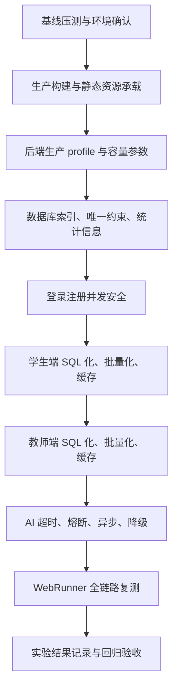

# WebRunner登录注册学生端教师端性能优化完整计划

> 一句话定位：本文档定义本项目在不修改现有功能和前端页面的前提下，面向 WebRunner 压测的登录注册、学生端、教师端和 AI 功能全链路性能优化目标、范围、任务与验收标准。
> 阅读前置：[../README.md](../README.md)、[../common/authoring-conventions.md](../common/authoring-conventions.md)、[09-登录注册与学生端200并发性能提升计划.md](09-登录注册与学生端200并发性能提升计划.md)
> 状态：草拟
> 日期：2026-07-03

## 1. 背景

当前 WebRunner 小范围压测结果已经暴露出明显性能风险：

| 事务 | 成功/失败 | 平均响应 | T90 | T99 | 判断 |
|------|------|------:|------:|------:|------|
| 学生端某核心事务 | 658/0 | 6275.65 ms | 9039 ms | 11960 ms | 普通业务已超过优异线 |
| 休息/学习类事务 | 655/0 | 2173.34 ms | 2245 ms | 2362 ms | 平均值偏高 |
| 看视频/资源类事务 | 651/0 | 2981.97 ms | 4152 ms | 4199 ms | 尾延迟偏高 |
| AI 求助/AI 功能事务 | 536/75 | 26122.04 ms | 31802 ms | 35743 ms | 外部 AI 同步延迟导致失败 |

性能测试关注指标包括并发用户数、TPS、平均/最小/最大响应时间、T50/T90/T99、标准差、错误率，以及 CPU、内存、磁盘 I/O、网络 I/O。当前问题不是单点慢，而是以下因素叠加：

| 层级 | 已读到的项目现状 | 性能风险 |
|------|------|------|
| 前端部署 | `frontend` 是 Vue 3 + Vue CLI，已有 `dist` 和 `splitChunks` 配置 | 若压测打到 dev server，会拖垮静态资源响应 |
| 后端配置 | 默认 `application.yml` 使用远程数据库、Hikari 最大 20、MyBatis stdout SQL 日志、controller/mapper debug 日志 | 200 并发下连接池、控制台 I/O、远程网络会放大延迟 |
| 登录注册 | 学生登录按 `username` 查询；学生注册已有重复键兜底，教师注册兜底不足 | 教师注册并发重复用户名可能变成 500 或 DB 异常 |
| 学生端 | 任务、提交、统计、进度、错题、画像、爬塔、题包多处存在全量查询、循环查询和同步事件处理 | T90/T99 易被 N+1 和事务内副作用拉高 |
| 教师端 | 课程 DTO 每课查课时数、任务统计先取全量提交、班级/学情分析按学生循环聚合、题库全量内存筛选 | 教师端统计页和题库页容易成为吞吐瓶颈 |
| AI 功能 | `AgenticClient` 同步调用 DeepSeek，Dify 客户端 blocking 且无显式超时；AI 批改、知识提取、教学建议同步等待 | AI 慢或不可用会把业务事务直接拖失败 |

本计划的核心原则是：不通过删除功能、隐藏页面、跳过业务逻辑来换压测结果；允许优化内部实现、部署方式、SQL、索引、缓存、异步任务、超时和降级。

## 2. 目标

### 2.1 总体目标

在单后端实例、生产构建前端、数据库与后端网络稳定的压测环境下，系统应稳定通过登录注册、学生端、教师端和 AI 功能混合压测，并让核心指标达到可展示的优秀水平。

### 2.2 核心指标目标

| 场景 | 并发 | 持续时间 | 平均响应 | T90 | T99 | 错误率 | TPS 目标 |
|------|------:|------:|------:|------:|------:|------:|------:|
| 静态资源 `/login`、JS、CSS、图片 | 200 | 3 min | <= 150 ms | <= 300 ms | <= 800 ms | 0 | >= 300 |
| 学生登录/教师登录 | 200 | 5 min | <= 300 ms | <= 600 ms | <= 1200 ms | 0 | >= 100 |
| 学生注册/教师注册唯一账号 | 200 | 3 min | <= 500 ms | <= 900 ms | <= 1500 ms | 0 | >= 60 |
| 重复用户名注册冲突 | 200 | 2 min | <= 400 ms | <= 800 ms | <= 1200 ms | HTTP 500 为 0 | >= 80 |
| 学生端普通查询链路 | 200 | 10 min | <= 600 ms | <= 1000 ms | <= 2000 ms | <= 0.1% | >= 80 |
| 学生端提交/通关写链路 | 100-200 | 5 min | <= 1000 ms | <= 1800 ms | <= 3000 ms | <= 0.5% | >= 40 |
| 教师端普通管理查询 | 200 | 10 min | <= 700 ms | <= 1200 ms | <= 2500 ms | <= 0.1% | >= 70 |
| 教师端统计/报表查询 | 100-200 | 5 min | <= 1200 ms | <= 2000 ms | <= 3500 ms | <= 0.5% | >= 30 |
| AI 前台触发接口 | 50-100 | 5 min | <= 1500 ms | <= 2500 ms | <= 5000 ms | HTTP 500 为 0 | >= 10 |

说明：

- AI 前台触发接口的目标是“接口不被外部 AI 拖垮”。真实大模型生成可以在后台继续完成，但前台接口必须有缓存、降级或异步状态，不应让 WebRunner 因 30 秒外部等待判失败。
- 如果后端与数据库跨公网或跨机房，网络 RTT 会成为硬下限；压测环境应尽量让应用与数据库同机或同内网。
- 目标值用于本轮优化验收，不代表必须改变页面展示或接口语义。

## 3. 范围

### 3.1 本次必须覆盖

| 范围 | 关键接口/页面 |
|------|------|
| 登录注册 | `/api/students/login`、`/api/students/register`、`/api/teachers/login`、`/api/teachers/register` |
| 学生端任务 | `/api/tasks`、`/api/tasks/{taskNo}`、`/api/tasks/{taskNo}/submit`、`/api/submissions/my` |
| 学生端统计 | `/api/students/{studentNo}/progress`、`/api/students/{studentNo}/stats`、`/api/student/{studentNo}/course/{courseCode}` |
| 学生端学习分析 | `/api/students/{studentNo}/mistakes`、`/api/knowledge-mastery/student/{studentNo}` |
| 学生端画像与爬塔 | `/api/students/{studentId}/profile`、`/api/students/{studentId}/tower-run`、`/api/students/{studentId}/tower-run/{runId}/nodes/{nodeId}/question-pack`、`/api/students/{studentId}/ability-radar` |
| 教师端课程/课时/资源 | `/api/courses/list`、`/api/courses/{courseCode}`、`/api/courses/{courseCode}/lessons`、`/api/lessons/{courseCode}`、`/api/resources` |
| 教师端任务/题库/批阅 | `/api/tasks`、`/api/tasks/{taskNo}/stats`、`/api/tasks/{taskNo}/submissions`、`/api/submissions/{submissionId}/grade`、`/api/questions/filter`、`/api/questions/course/{courseCode}` |
| 教师端班级运营 | `/api/classes`、`/api/classes/{id}`、`/api/classes/{id}/students/batch`、`/api/classes/{id}/progress`、`/api/classes/{id}/scores` |
| AI 功能 | `/submission/ai-review/{submissionId}`、`/api/knowledge-points/{id}/qa`、`/api/knowledge-points/{id}/explain`、`/api/classes/{classId}/teaching-suggestions`、`/api/classes/{classId}/problem-cluster` |

### 3.2 不做

- 不修改现有前端页面布局、样式、路由结构和可见交互。
- 不删除接口、不改接口路径、不改变已有请求参数含义。
- 不为了压测直接返回假成功，不跳过权限、提交、批阅、统计、题包、画像等业务逻辑。
- 不把 Axios timeout 加大当作主要优化手段。
- 不把外部 AI 服务延迟算作核心业务必须同步等待的条件。
- 不在生产压测中使用 Vue dev server 承载静态资源。

## 4. 需求描述

### R1 组：指标与压测边界

**R1.1** 系统应在 200 并发登录压测期间保持 HTTP 失败数为 0，登录业务失败只允许来自账号密码错误等预期业务场景。

**R1.2** 系统应在 WebRunner 报告中输出平均响应时间、T50、T90、T99、标准差、TPS、失败数和错误率，且每个事务名称能映射到具体页面或接口。

**R1.3** 当压测包含 AI 事务时，系统应区分“前台请求响应时间”和“外部 AI 实际生成耗时”，避免外部 AI 抖动直接污染核心业务接口错误率。

**R1.4** 在性能测试期间，系统应同步记录 CPU、内存、磁盘 I/O、网络 I/O、Tomcat 线程、Hikari 连接池、数据库慢 SQL 和 GC 指标。

### R2 组：部署与运行时

**R2.1** 系统应使用 `frontend/dist` 生产构建产物进行压测，不应使用 `npm run serve` 或 webpack-dev-server 作为静态资源服务器。

**R2.2** 系统应使用生产 profile 启动后端，关闭 MyBatis stdout SQL 日志，并启用合理的 Tomcat、Hikari、压缩和 JVM 参数。

**R2.3** 如果数据库与后端不在同一内网，则系统应在压测报告中记录网络 RTT，并把远程数据库网络延迟列为环境风险。

### R3 组：登录注册

**R3.1** 当学生或教师使用合法账号登录时，系统应在不改变返回结构的前提下走用户名唯一索引查询，并在目标时间内返回登录结果。

**R3.2** 当注册请求使用唯一用户名时，系统应依赖数据库唯一约束保证并发安全，并返回现有注册成功语义。

**R3.3** 如果注册请求使用重复用户名，则系统应返回业务失败结果，不应向 WebRunner 暴露 HTTP 500、数据库堆栈或连接异常。

**R3.4** 如果登录或注册请求缺少用户名、密码、姓名等必填字段，则系统应快速返回业务失败，不应访问数据库进行无效查询。

### R4 组：学生端

**R4.1** 学生端任务列表、任务详情、我的提交、学习进度和成绩统计应避免 N+1 查询，单接口 SQL 往返次数应与任务数、题目数、学生数解耦。

**R4.2** 当学生提交测验或作业时，系统应在事务内完成核心提交数据写入，并将画像、成长、楼层、事件等非核心副作用放到事务提交后执行。

**R4.3** 当学生查询错题、掌握度、画像、排行榜、爬塔地图、题包和雷达图时，系统应使用批量查询、短 TTL 缓存或 SQL 聚合保证 T90/T99 稳定。

**R4.4** 当 200 并发首次进入同一学生同一课程爬塔时，系统应只保留一个 active run；重复请求应复用已有 run，不应生成重复脏数据。

**R4.5** 当 200 并发请求同一节点题包时，系统应只生成一个 `runId + nodeId + mode` 题包；其他请求应复用或重新查询已生成题包。

### R5 组：教师端

**R5.1** 教师端课程列表应一次性返回课程与课时数量，不应每个课程单独查询课时。

**R5.2** 教师端任务统计、课程统计、班级进度、成绩概览和错题统计应使用 SQL 聚合或批量查询，不应按任务或学生循环调用服务。

**R5.3** 教师端提交列表和批阅详情应批量加载学生、题目、知识点和答案明细，不应在每条提交或每道题上逐个查库。

**R5.4** 教师端题库筛选和组卷应让数据库先按课程、课时、知识点、题型、难度过滤，再在内存中执行必要的随机/平衡逻辑。

**R5.5** 教师端班级批量加入学生、任务批量分配和风险检测应批量校验、批量写入或批量聚合，不应逐个学生串行查库。

### R6 组：AI 功能

**R6.1** AI 客户端应设置连接超时、读取超时、连接池、并发上限和失败熔断，Dify blocking 模式也必须有显式超时。

**R6.2** 当外部 AI 超时、限流或不可用时，系统应返回可解释的业务降级结果或已有缓存结果，不应使核心接口 HTTP 500。

**R6.3** 当同一 AI 请求在短时间内重复触发时，系统应复用正在进行的任务或缓存结果，避免 200 并发同时打爆外部 AI。

**R6.4** AI 批改、教学建议、问题聚类、知识讲解和问答应能分别记录外部 AI 耗时、超时次数、降级次数和命中缓存次数。

### R7 组：回归约束

**R7.1** 所有性能优化完成后，学生端和教师端页面的视觉展示、按钮、路由、主流程和接口数据结构应保持不变。

**R7.2** 所有权限判断应保持不变，学生不能读取他人数据，普通教师不能修改非授课课程，管理员权限不应被削弱。

**R7.3** 所有写入类接口应保持业务一致性，不能因为异步化导致提交、批阅、题包、画像和进度出现不可恢复的不一致。

## 5. 当前代码重点发现

| 模块 | 文件 | 发现 |
|------|------|------|
| 默认配置 | `backend/src/main/resources/application.yml` | 默认远程 PostgreSQL 地址、Hikari 最大 20、MyBatis `StdOutImpl`、mapper/controller debug 日志 |
| 生产配置 | `backend/src/main/resources/application-prod.yml` | 已有连接池、Tomcat、压缩、nologging 配置，应作为压测启动基线 |
| 索引 | `backend/src/main/resources/performance-indexes.sql`、`schema-kingbase.sql` | 已补一批学生端索引，但教师端、AI review、班级运营、题库组合筛选仍需补齐 |
| 学生注册 | `StudentServiceImpl` | 已有空值校验、事务和 `DuplicateKeyException` 兜底，可作为教师注册改造样板 |
| 教师注册 | `TeacherServiceImpl` | 缺少空值校验、事务和重复键异常兜底 |
| 课程列表 | `CourseServiceImpl.toDto` | 每个课程调用 `lessonService.listByCourseCode` 统计课时，典型 N+1 |
| 学生进度 | `LearningProgressServiceImpl.buildCourseProgress` | 全量学生列表、按任务查提交、按学生 `getById`，教师端课程进度 T99 风险大 |
| 学生成绩 | `StatsServiceImpl.buildCourseStats` | 按任务循环查询提交并在 Java 内聚合 |
| 错题分析 | `AnalysisServiceImpl.buildCourseWrongStats` | 按课程任务循环查询答案，应改为一次 join/聚合 |
| 提交详情 | `TaskSubmissionServiceImpl.buildGradeDetail` | 已有部分批量查询，但知识点名、题目难度、历史 attempt 仍可能重复查 |
| 提交事件 | `TaskSubmissionServiceImpl.publishAssessmentResultEvents`、`ProfileGameEventListener` | Spring 事件默认同步监听，画像/成长更新会拉长提交响应 |
| 教师提交列表 | `TaskSubmissionServiceImpl.listDtoByTaskNo` | 已批量加载学生，仍可进一步用 SQL 取每学生最新有效提交 |
| 题库组卷 | `QuestionServiceImpl.generateExam` | 先全量取课程题目再内存筛选，数据量增大后影响教师端 |
| 班级运营 | `ClassInfoServiceImpl.enrollStudents` | 批量加入学生时逐个查学生、逐个插入 |
| 学情分析 | `Module13ExternalDataProvider`、`ScoreAnalysisServiceImpl` | 班级进度、趋势和风险检测按学生循环聚合 |
| AI 客户端 | `AgenticClient`、`DifyClient` | DeepSeek 有 3s/10s 超时；Dify 没有显式超时；均以 blocking 为主 |
| AI 批改 | `SubmissionAiReviewServiceImpl.generateReview` | 同步调用 AI，失败后本地草稿兜底，但接口仍可能等待外部 AI |

## 6. 总体优化路线



优先级说明：

| 优先级 | 内容 | 理由 |
|------|------|------|
| P0 | 正确压测部署、prod profile、日志关闭、连接池/线程、核心索引、登录注册重复键兜底、AI 超时 | 不做这些，后续 SQL 优化会被环境噪声掩盖 |
| P1 | 学生端/教师端高频接口批量化和 SQL 聚合、事件异步、短 TTL 缓存 | 直接决定 T90/T99 和 TPS |
| P2 | 报表预计算、批量导入优化、读写分离、二级缓存、更多压测脚本 | 用于进一步拉高展示指标和稳定长测 |

## 7. P0：压测环境与部署

### 7.1 前端只压生产构建产物

执行：

```bash
cd frontend
npm run build
```

压测时只用 `frontend/dist`，由 Nginx、Caddy、IIS 或同等级静态服务器承载：

- JS/CSS/图片启用 gzip 和长缓存。
- `/practical-training/**` 反向代理到 Spring Boot。
- 不使用 `npm run serve` 参与压测。
- 不修改任何 `src/views/*.vue` 页面。

验收：

- `/login`、最大 JS chunk、最大 CSS、图片资源 200 并发失败数为 0。
- 静态资源 T90 <= 300 ms。
- 不出现 `ConnectionAbortedError(10053)`。

### 7.2 后端使用生产 profile

压测启动命令建议：

```bash
java -Xms1g -Xmx2g -XX:+UseG1GC -jar backend/target/practical-training-backend-0.0.1-SNAPSHOT.jar --spring.profiles.active=prod
```

基线配置：

| 项 | 建议值 |
|------|------|
| Hikari maximum-pool-size | 60 起步，结合数据库承载微调 |
| Hikari minimum-idle | 15 |
| Tomcat max threads | 300 |
| Tomcat accept-count | 500 |
| Tomcat max-connections | 10000 |
| MyBatis SQL 日志 | `NoLoggingImpl` |
| Controller/Mapper 日志 | info/warn |
| HTTP compression | 开启 |

验收：

- 压测中 Hikari pending connection 不持续大于 0。
- Tomcat busy threads 不持续贴近 max。
- 控制台不刷屏输出 SQL。
- GC 无明显长暂停。

### 7.3 数据库与索引落库

必须先在真实压测库执行并验证索引存在。已有 `performance-indexes.sql` 可作为基础，还需补齐教师端和 AI 相关索引：

```sql
CREATE UNIQUE INDEX IF NOT EXISTS uk_teacher_username ON teacher(username);

CREATE INDEX IF NOT EXISTS idx_learning_task_course_status_type_lesson
    ON learning_task(course_code, status, task_type, lesson_no, task_no DESC);

CREATE INDEX IF NOT EXISTS idx_question_course_filter
    ON question(course_code, knowledge_point_id, type, difficulty, question_id DESC);

CREATE INDEX IF NOT EXISTS idx_submission_ai_review_submission_time
    ON submission_ai_review(submission_id, create_time DESC);

CREATE INDEX IF NOT EXISTS idx_course_resource_course_filter
    ON course_resource(course_code, resource_type, knowledge_point_id, uploaded_at DESC);

CREATE INDEX IF NOT EXISTS idx_analytics_class_student_student
    ON analytics_class_student(student_id, class_id);

CREATE INDEX IF NOT EXISTS idx_risk_alert_student_status_type
    ON analytics_risk_alert(student_id, status, risk_type);
```

执行索引后应对核心表执行统计信息刷新，例如 PostgreSQL/Kingbase 兼容环境下的 `ANALYZE`。

## 8. P0：AI 延迟治理

AI 是当前最明显的失败来源，必须从“同步等待外部模型”调整为“业务接口可控返回，外部 AI 可慢但不拖垮系统”。

### 8.1 超时和连接池

| 客户端 | 当前风险 | 优化要求 |
|------|------|------|
| DeepSeek/Agentic | 有 3s 连接、10s 读取超时，但无并发上限/熔断 | 增加连接池、最大并发、失败熔断、慢调用统计 |
| Dify | 使用 blocking 模式且无显式超时 | 使用带超时的 request factory，设置连接/读取超时 |
| 所有 AI 调用 | 并发重复请求会打爆外部服务 | 同一业务 key 请求合并、短 TTL 缓存、后台任务去重 |

### 8.2 业务降级

| AI 场景 | 降级策略 | 页面/功能影响 |
|------|------|------|
| AI 批改 | 优先返回最新 review；没有 review 时快速生成本地草稿，同时后台刷新真实 AI review | 页面仍看到评阅结果 |
| 知识点讲解/问答 | 命中缓存直接返回；AI 超时返回服务繁忙的业务结果并记录降级 | 不改变页面，只是不让接口 30 秒失败 |
| 教学建议/问题聚类 | 先返回最近一次结果或规则建议；后台生成新结果 | 教师端仍有建议数据 |
| 推荐理由 | 本地规则理由即时返回；AI reason 异步刷新 | 推荐功能不消失 |

验收：

- AI 外部服务断开时，核心学生端/教师端非 AI 接口错误率不受影响。
- AI 事务 HTTP 500 为 0。
- AI 事务 T99 <= 5000 ms；真实 AI 生成耗时单独统计。
- 日志中能看到 AI 超时次数、熔断次数、降级次数、缓存命中次数。

## 9. P1：登录注册优化

### 9.1 学生登录注册

保持现有接口和返回结构不变：

- `StudentMapper.selectByUsername` 走 `uk_student_username`。
- 注册最终以数据库唯一约束兜底。
- 空 username/password/name 快速失败。
- 重复键异常转业务失败，不暴露 500。

### 9.2 教师登录注册

教师端需要补齐与学生端一致的并发安全：

- `TeacherServiceImpl.login` 增加 username/password 空值快速失败。
- `TeacherServiceImpl.register` 增加 teacher/name/username/password 空值校验。
- `TeacherServiceImpl.register` 增加事务和 `DuplicateKeyException` 捕获。
- 确认 `uk_teacher_username` 已在真实数据库存在。

验收：

- 200 并发教师重复用户名注册时，只允许一个成功，其余为业务失败，不出现 HTTP 500。
- 学生/教师登录 T90 <= 600 ms。

## 10. P1：学生端链路优化

### 10.1 任务列表和任务详情

涉及文件：

- `TaskController`
- `TaskAssignmentServiceImpl`
- `TaskAssignmentMapper.xml`

优化要求：

- `selectAssignedTasks` 继续使用 join，但确认命中 `idx_task_assignment_student_course_status`。
- `TaskController.detail` 的 active assignment 查询命中 `idx_task_assignment_task_student_status`。
- 对学生任务列表增加短 TTL 缓存，key 为 `studentNo + courseCode + taskType + status + lessonNo`，任务分配、取消、提交时清理。

### 10.2 作业/测验提交

涉及文件：

- `TaskSubmissionController`
- `TaskSubmissionServiceImpl`
- `TaskSubmissionMapper.xml`
- `SpringGameEventPublisher`
- `ProfileGameEventListener`

优化要求：

- `countByStudentAndTask`、`supersedePrevious` 命中组合索引。
- 自动判题一次批量加载题目，不按每道题查库。
- `publishAssessmentResultEvents` 不在提交主事务内同步阻塞响应。
- `questionDifficulty`、`attemptCount` 改为批量预加载或 SQL 聚合。
- 同一学生同一任务并发提交时，用事务或行级锁保护 `maxAttempts` 和 attempt number。

验收：

- 100-200 并发提交不同学生测验，不出现死锁、重复 attempt 错乱或 HTTP 500。
- 提交接口 T90 <= 1800 ms。

### 10.3 进度、统计、错题

涉及文件：

- `StatsServiceImpl`
- `LearningProgressServiceImpl`
- `AnalysisServiceImpl`
- `BehaviorLogMapper.xml`

优化要求：

- `buildStudentStats` 批量加载任务信息，替换循环 `taskService.getById`。
- `buildStudentCourseStats` 用 SQL 按 `student_no + course_code` 聚合。
- `buildStudentProgress` 最近行为日志只查 `LIMIT 10`。
- `buildCourseProgress` 改为批量查询班级学生、任务、提交矩阵，不按学生循环 `getById`。
- `buildCourseWrongStats` 改为一次 join 查询课程下答案，不按任务循环查。
- 知识点名称批量加载。

验收：

- `/api/students/{studentNo}/progress` 200 并发 T90 <= 1000 ms。
- `/api/students/{studentNo}/stats` 200 并发 T90 <= 1000 ms。
- `/api/students/{studentNo}/mistakes` 200 并发 T90 <= 1500 ms。

### 10.4 画像、爬塔、题包、雷达图

涉及文件：

- `ProfileServiceImpl`
- `TowerRunServiceImpl`
- `TowerQuestionPackServiceImpl`
- `AbilityRadarServiceImpl`

优化要求：

- `getOrCreateProfile` 并发创建时依赖唯一约束并捕获重复键后 reselect。
- `student_tower_run` active run 使用唯一约束保护。
- `student_tower_question_pack` 使用 `run_id + node_id + mode` 唯一约束保护。
- 题包 DTO 批量加载题目。
- 课程知识点、能力点、能力-知识点映射按课程短 TTL 缓存。
- 雷达图按学生课程批量加载当前分数和 delta。

验收：

- 200 并发首次进入同一学生同一课程，只产生一个 active run。
- 200 并发请求同一节点题包，只产生一个题包。
- tower-run、question-pack、ability-radar T90 <= 1500 ms。

## 11. P1：教师端链路优化

### 11.1 课程、课时、资源

涉及文件：

- `CourseServiceImpl`
- `LessonServiceImpl`
- `CourseResourceServiceImpl`
- `CourseMapper.xml`
- `LessonMapper.xml`

优化要求：

- 课程列表用一次 SQL 返回课程和课时数量，避免每课 `lessonService.listByCourseCode`。
- 课时详情中课程名/教师名可 join 查询或短 TTL 缓存课程基础信息。
- 资源列表按 `course_code + resource_type + knowledge_point_id + uploaded_at` 索引查询。
- 搜索类接口在压测脚本中使用合理关键字，不用空关键字扫全表。

验收：

- `/api/courses/list` 教师端 200 并发 T90 <= 1000 ms。
- `/api/resources?courseCode=` 200 并发 T90 <= 1200 ms。

### 11.2 任务管理与任务统计

涉及文件：

- `TaskController`
- `LearningTaskMapper.xml`
- `TaskSubmissionMapper.xml`

优化要求：

- 任务列表命中 `idx_learning_task_course_status_type_lesson`。
- `taskStats` 不再先取全量提交再 Java 聚合，改为 SQL 一次返回提交数、已批阅数、逾期数、平均分、提交学生数。
- `countActiveByTaskNo` 命中 `idx_task_assignment_task_student_status`。
- 批量分配任务时批量校验学生存在性，并批量 upsert assignment。

验收：

- `/api/tasks/{taskNo}/stats` 200 并发 T90 <= 1200 ms。
- 批量分配 200 个学生不出现 N 次查询学生和 N 次重复异常刷屏。

### 11.3 提交列表与批阅详情

涉及文件：

- `TaskSubmissionController`
- `TaskSubmissionServiceImpl`
- `SubmissionAnswerMapper.xml`
- `QuestionMapper.xml`

优化要求：

- `listDtoByTaskNo` 用 SQL 窗口函数或子查询取每个学生最新有效提交。
- 批量加载学生姓名、任务信息，不在 DTO 循环中查库。
- `buildGradeDetail` 批量加载答案对应题目、知识点名称。
- 教师批阅更新只更新必要字段，完成后异步触发画像/统计刷新。

验收：

- `/api/tasks/{taskNo}/submissions` 200 并发 T90 <= 1500 ms。
- `/api/submissions/{submissionId}/grade` 200 并发 T90 <= 1500 ms。

### 11.4 题库、筛选、组卷

涉及文件：

- `QuestionController`
- `QuestionServiceImpl`
- `QuestionMapper.xml`

优化要求：

- `filterQuestions` 以数据库筛选为主，命中 `idx_question_course_filter`。
- `generateExam` 不再全量加载课程题目后内存过滤；先按课程、题型、知识点、难度在 SQL 缩小候选集。
- 题库列表可增加分页参数兼容；当前页面若未传分页，保持返回结构不变，但教师端压测数据量要控制。
- 组卷过程中的候选题集按课程和筛选条件短 TTL 缓存，题库变更时清理。

验收：

- `/api/questions/filter` 200 并发 T90 <= 1200 ms。
- 组卷接口在 100 并发下不出现全表扫描导致的 T99 飙升。

### 11.5 班级运营与学情分析

涉及文件：

- `ClassInfoServiceImpl`
- `Module13ExternalDataProvider`
- `ScoreAnalysisServiceImpl`
- `RiskDetectionService`
- `RiskAlertMapper.xml`

优化要求：

- 班级学生列表用 join 一次返回。
- `enrollStudents` 批量校验、批量插入或批量忽略重复。
- `getClassProgressList` 不按学生循环 `getStudentProgress`，改为一次查出班级学生、课程任务、学生提交聚合。
- 成绩概览、成绩趋势、风险检测使用批量数据集，不按学生循环调用 `getStudentScores`。
- 活跃风险查询命中 `idx_risk_alert_student_status_type`。

验收：

- `/api/classes/{id}/progress` 100-200 并发 T90 <= 2000 ms。
- `/api/classes/{id}/scores` 100-200 并发 T90 <= 2000 ms。
- 风险检测接口在测试班级 200 人数据下不超过 5 s，且不影响其他接口。

### 11.6 教师端 AI 建议与聚类

涉及文件：

- `ProblemClusterService`
- `TeachingSuggestionService`
- `AgenticClient`

优化要求：

- 教学建议和问题聚类优先返回最近一次结果或规则结果。
- 后台刷新真实 AI 结果。
- 同一 classId/courseId 同一时间只允许一个 AI 生成任务。
- AI 结果持久化到 `analytics_report` 或 `analytics_teaching_suggestion` 后供 GET 查询。

验收：

- 外部 AI 慢时，教师端普通统计接口不受影响。
- AI 生成接口 HTTP 500 为 0，T99 <= 5000 ms。

## 12. 缓存策略

只缓存读多写少、短时间允许轻微延迟的数据。不得缓存绕过登录、权限和提交写入。

| 缓存项 | Key | TTL | 清理时机 |
|------|------|------:|------|
| 课程基础信息 | `courseCode` | 2 min | 课程更新/删除 |
| 课程课时数 | `courseCode` | 1 min | 课时新增/更新/删除 |
| 知识点列表 | `courseCode + chapter` | 1 min | 知识点变更 |
| 能力点/能力映射 | `courseCode` | 1 min | 能力图谱变更 |
| 学生任务列表 | `studentNo + courseCode + filters` | 30 s | 任务分配/取消/提交 |
| 排行榜 | `courseCode + type` | 30 s | 画像成长值变化 |
| 题库候选集 | `courseCode + filters` | 30 s | 题目增删改 |
| AI review | `submissionId` | 5 min | 手动重新生成 |
| 教学建议/聚类 | `classId + courseId` | 5 min | 手动重新生成或数据更新 |

## 13. WebRunner 压测方案

### 13.1 数据准备

| 数据 | 建议规模 | 说明 |
|------|------:|------|
| 学生账号 | 500-1000 | 至少 200 个可登录账号 |
| 教师账号 | 20-50 | 至少 10 个普通教师、1 个管理员 |
| 课程 | 5-10 | 每个课程绑定教师 |
| 课时 | 每课 20 | 覆盖课程详情和课时列表 |
| 学习任务 | 每课 30 | 包含 quiz、programming、reading、video |
| 题目 | 每课 1000 | 覆盖题型、难度、知识点 |
| 提交记录 | 1万以上 | 覆盖统计/批阅 |
| 行为日志 | 5万以上 | 覆盖进度时间线和活跃度 |
| 班级 | 5-10 | 每班 100-200 学生 |
| AI review | 部分预生成 | 用于缓存命中场景 |

### 13.2 事务矩阵

| 事务名 | 用户 | 步骤 | 并发 | 通过标准 |
|------|------|------|------:|------|
| login_student | 学生 | 登录并保存 cookie | 200 | T90 <= 600 ms，失败 0 |
| login_teacher | 教师 | 登录并保存 cookie | 200 | T90 <= 600 ms，失败 0 |
| register_student_unique | 游客 | 唯一学生账号注册 | 200 | 成功率符合数据，HTTP 500 为 0 |
| register_teacher_unique | 游客 | 唯一教师账号注册 | 200 | 成功率符合数据，HTTP 500 为 0 |
| student_core_read | 学生 | 任务列表、进度、统计、错题、画像、题包 | 200 | 普通 GET T90 <= 1000 ms |
| student_submit | 学生 | 获取任务、提交测验/作业、查看结果 | 100-200 | 写接口 T90 <= 1800 ms |
| teacher_core_read | 教师 | 课程列表、任务列表、题库筛选、提交列表 | 200 | T90 <= 1200 ms |
| teacher_stats | 教师 | 任务统计、课程统计、班级进度、成绩概览 | 100-200 | T90 <= 2000 ms |
| teacher_grade | 教师 | 查看批阅详情、提交评分 | 100 | T90 <= 1800 ms |
| ai_review | 学生/教师 | 触发 AI review、查询 review | 50-100 | HTTP 500 为 0，T99 <= 5000 ms |
| ai_teacher | 教师 | 教学建议/聚类生成或获取 | 50 | HTTP 500 为 0，普通统计不受影响 |

### 13.3 运行顺序

1. 静态资源单独压测。
2. 登录注册单接口压测。
3. 学生端核心读链路压测。
4. 学生端写链路压测。
5. 教师端核心读链路压测。
6. 教师端统计链路压测。
7. AI 功能降级/缓存/后台生成压测。
8. 全链路混合压测 10-30 分钟。

### 13.4 监控采集

| 指标 | 采集方式 | 关注点 |
|------|------|------|
| WebRunner 报告 | 工具导出 | 成功数、失败数、TPS、T50/T90/T99、标准差 |
| JVM | JDK/JMX/日志 | heap、GC、线程数 |
| Tomcat | Actuator 或日志 | busy threads、连接数 |
| Hikari | Actuator/JMX | active、idle、pending、timeout |
| 数据库 | 慢 SQL、执行计划、连接数 | 全表扫描、锁等待、索引命中 |
| AI | 应用日志/指标 | 超时、熔断、降级、缓存命中 |
| 系统资源 | OS 监控 | CPU、内存、磁盘 I/O、网络 I/O |

## 14. 实验结果记录表模板

| 测试人员 | 测试时间 | 测试环境 | 后端版本 | 前端版本 |
|------|------|------|------|------|
|  |  |  |  |  |

| 场景 | 并发用户数 | 事务数 | 成功数 | 失败数 | 平均响应 | T50 | T90 | T99 | 标准差 | TPS | CPU峰值 | 内存峰值 | 结论 |
|------|------:|------:|------:|------:|------:|------:|------:|------:|------:|------:|------:|------:|------|
| 学生登录 | 50 |  |  |  |  |  |  |  |  |  |  |  |  |
| 学生登录 | 100 |  |  |  |  |  |  |  |  |  |  |  |  |
| 学生登录 | 200 |  |  |  |  |  |  |  |  |  |  |  |  |
| 教师登录 | 200 |  |  |  |  |  |  |  |  |  |  |  |  |
| 学生端核心读链路 | 200 |  |  |  |  |  |  |  |  |  |  |  |  |
| 学生端提交链路 | 100 |  |  |  |  |  |  |  |  |  |  |  |  |
| 教师端核心读链路 | 200 |  |  |  |  |  |  |  |  |  |  |  |  |
| 教师端统计链路 | 100 |  |  |  |  |  |  |  |  |  |  |  |  |
| AI 批改/求助 | 50 |  |  |  |  |  |  |  |  |  |  |  |  |

## 15. 实施任务

- [ ] **T0 记录基线**（满足 R1.1-R1.4）
  - 验收：保存当前 WebRunner 报告、慢接口截图、服务器资源截图。
  - 验证：重复跑同一脚本两次，确认基线稳定。
  - 文件：`specs/党圣航/`、`output/`。
  - 规模：S。

- [ ] **T1 修正压测部署**（满足 R2.1）
  - 验收：静态资源由生产构建和静态服务器承载，200 并发静态资源失败数为 0。
  - 验证：WebRunner 静态资源场景。
  - 文件：部署脚本、Nginx/Caddy/IIS 配置说明。
  - 规模：S。

- [ ] **T2 启用后端生产 profile**（满足 R2.2）
  - 验收：SQL stdout 日志关闭，Hikari/Tomcat/JVM 参数生效。
  - 验证：启动日志、JMX/Actuator、登录压测。
  - 文件：`backend/src/main/resources/application-prod.yml`、启动脚本。
  - 规模：S。

- [ ] **T3 落库索引与执行计划检查**（满足 R2.3、R4、R5）
  - 验收：所有核心索引存在，慢 SQL 执行计划不出现主要全表扫描。
  - 验证：数据库 `EXPLAIN`、慢 SQL 日志。
  - 文件：`backend/src/main/resources/performance-indexes.sql`、`schema-kingbase.sql`。
  - 规模：M。

- [ ] **T4 登录注册并发安全**（满足 R3.1-R3.4）
  - 验收：学生/教师登录注册 200 并发达标，重复用户名不出现 500。
  - 验证：WebRunner 登录注册脚本、后端单元测试。
  - 文件：`StudentServiceImpl.java`、`TeacherServiceImpl.java`、相关 Mapper/测试。
  - 规模：S。

- [ ] **T5 学生端任务与提交链路优化**（满足 R4.1-R4.2）
  - 验收：任务列表、任务详情、提交接口 T90 达标。
  - 验证：学生端任务读写压测、并发提交一致性测试。
  - 文件：`TaskController.java`、`TaskSubmissionController.java`、`TaskSubmissionServiceImpl.java`、相关 Mapper。
  - 规模：M。

- [ ] **T6 学生端统计/进度/错题优化**（满足 R4.3）
  - 验收：进度、统计、错题接口 T90 达标，SQL 往返次数显著减少。
  - 验证：WebRunner 学生端读链路、慢 SQL 日志。
  - 文件：`StatsServiceImpl.java`、`LearningProgressServiceImpl.java`、`AnalysisServiceImpl.java`、相关 Mapper。
  - 规模：M。

- [ ] **T7 学生画像、爬塔、题包和雷达图优化**（满足 R4.4-R4.5）
  - 验收：active run 和题包并发唯一，画像/题包/雷达图 T90 达标。
  - 验证：200 并发同一学生同一课程 run/pack 测试。
  - 文件：`ProfileServiceImpl.java`、`TowerRunServiceImpl.java`、`TowerQuestionPackServiceImpl.java`、`AbilityRadarServiceImpl.java`。
  - 规模：M。

- [ ] **T8 教师端课程、任务、提交、题库优化**（满足 R5.1-R5.4）
  - 验收：课程列表、任务统计、提交列表、批阅详情、题库筛选 T90 达标。
  - 验证：WebRunner 教师端核心读链路。
  - 文件：`CourseServiceImpl.java`、`TaskController.java`、`TaskSubmissionServiceImpl.java`、`QuestionServiceImpl.java`、相关 Mapper。
  - 规模：M。

- [ ] **T9 教师端班级运营和学情分析优化**（满足 R5.5）
  - 验收：班级进度、成绩概览、风险检测不按学生串行放大。
  - 验证：100-200 并发教师端统计链路。
  - 文件：`ClassInfoServiceImpl.java`、`Module13ExternalDataProvider.java`、`ScoreAnalysisServiceImpl.java`、`RiskDetectionService.java`、相关 Mapper。
  - 规模：M。

- [ ] **T10 AI 超时、熔断、缓存和异步化**（满足 R6.1-R6.4）
  - 验收：外部 AI 慢/断开时 AI 事务 HTTP 500 为 0，核心接口不受影响。
  - 验证：模拟 AI 超时、断网、限流压测。
  - 文件：`AgenticClient.java`、`DifyClient.java`、`SubmissionAiReviewServiceImpl.java`、`ProblemClusterService.java`、`TeachingSuggestionService.java`。
  - 规模：L。

- [ ] **T11 全量回归与结果报告**（满足 R7.1-R7.3）
  - 验收：功能回归通过，WebRunner 最终报告指标达到目标线。
  - 验证：Maven 测试、前端测试、手工主流程、WebRunner 全链路。
  - 文件：`output/性能测试报告/`、`specs/党圣航/`。
  - 规模：M。

## 16. 回归测试清单

| 回归项 | 要求 |
|------|------|
| 学生注册 | 成功后仍按现有流程回登录页 |
| 学生登录 | 成功后仍进入现有学生端流程 |
| 教师登录 | 成功后教师端课程、任务、题库、批阅可用 |
| 权限 | 学生不能访问他人提交；普通教师不能修改非授课课程 |
| 任务提交 | 次数、逾期、附件格式、自动判题逻辑不变 |
| 教师批阅 | 分数、反馈、状态更新逻辑不变 |
| 画像/爬塔 | active run、节点状态、题包内容、通关结算不丢失 |
| AI 批改 | 有结果可看；AI 不可用时有明确降级，不出现 500 |
| 学情分析 | 统计口径不因 SQL 聚合改造而变化 |
| 前端页面 | 不改变页面结构、样式、按钮和路由 |

## 17. 风险与应对

| 风险 | 表现 | 应对 |
|------|------|------|
| 数据库远程网络延迟 | 登录这种轻接口也秒级 | 后端和数据库同内网部署；报告记录 RTT |
| 连接池盲目调大 | 数据库 CPU/连接数打满 | 先查慢 SQL 和索引，再调整 pool |
| AI 服务不可控 | T99 超过 30 秒，失败数上升 | 超时、熔断、缓存、异步、降级 |
| 缓存不一致 | 修改后短时间读到旧数据 | TTL 控制在 30s-2min，写操作清理缓存 |
| 异步事件丢失 | 画像或成长值未更新 | 有界队列、失败重试、补偿任务、降级日志 |
| 压测数据污染 | 注册/提交/通关写入正式数据 | 使用测试课程、测试账号、清理 SQL |
| 只优化平均值 | T90/T99 仍高 | 每轮必须看 T90/T99、标准差和慢 SQL |

## 18. 完成定义

本轮性能优化只有同时满足以下条件才算完成：

- 登录注册、学生端、教师端、AI 功能均有 WebRunner 结果记录。
- 核心指标表中的平均响应、T90、T99、错误率和 TPS 达到目标或有明确环境原因说明。
- 后端没有通过删除功能、跳过权限或修改页面来取得压测结果。
- 静态资源不再由 Vue dev server 承载。
- 生产 profile、生效索引、慢 SQL 记录、JVM/连接池/线程池指标均可追溯。
- AI 慢或不可用时，系统不把外部模型延迟扩散成核心业务失败。
- 学生端和教师端主流程人工回归通过。
