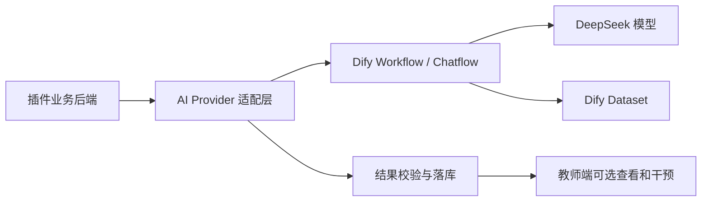

# AI 能力迁移到 Dify 的分层方案与操作指南

## 1. 文档目的

本文面向第一次使用 Dify 的开发者，回答三个问题：

1. 当前项目中哪些 AI 功能可以直接搬到 Dify。
2. 哪些功能可以先搬到 Dify，但需要顺手优化输入、输出和调用方式。
3. 哪些功能涉及业务模型或能力点重构，不能只复制原提示词，需要重新设计。

本次迁移的总体原则是：

> Dify 负责模型调用、提示词、工作流和知识库；插件后端负责数据库、权限、业务规则、结果校验和最终落库。

教师不需要直接操作 Dify。默认由插件自动触发 AI 任务，教师只在需要时查看、修改、发布或回滚结果。

## 2. 当前 AI 架构现状

当前后端已经有统一的 `AgenticClient`，根据 capability 选择不同的系统提示词，再直接调用 DeepSeek：

```text
业务 Service
  → AgenticClient
  → 系统提示词 + 本次业务上下文
  → DeepSeek API
  → JSON/文本解析
  → 业务 Service
```

主要实现位置：

- `backend/src/main/java/com/neu/CoursePlatform/agentic/AgenticClient.java`
- `backend/src/main/java/com/neu/CoursePlatform/service/impl/CourseAiServiceImpl.java`
- `backend/src/main/java/com/neu/CoursePlatform/service/impl/KnowledgeExtractionServiceImpl.java`
- `backend/src/main/java/com/neu/CoursePlatform/service/impl/SubmissionAiReviewServiceImpl.java`
- `backend/src/main/java/com/neu/CoursePlatform/service/impl/TowerDiagnosisAsyncService.java`

目前 `DifyClient` 和 `DifyKnowledgeService` 已经存在，但项目环境还没有配置真实的 Dify 地址、Workflow Key 或 Dataset ID。迁移后，`AgenticClient` 不再保存全部业务提示词，而是作为兼容层或逐步替换为 `DifyProvider`。

## 3. 迁移等级判断

### 3.1 第一批：可以直接搬到 Dify

这类功能的共同特点是：输入和输出已经比较稳定，AI 不需要直接修改数据库，后端只需要接收结果并进行校验。

| 功能 | 当前 capability | Dify 类型 | 迁移判断 | 说明 |
|---|---|---|---|---|
| 错题问题聚类 | `clusterProblems` | Workflow | 直接迁移 | 输入班级错题摘要，输出问题数组 |
| 教学建议 | `teachingSuggestions` | Workflow | 直接迁移 | 输入班级学情摘要，输出建议数组 |
| 学习风险检测 | `riskDetect` | Workflow | 直接迁移 | 输入学生学习统计，输出风险数组 |
| 作业智能评阅 | `assessment` | Workflow | 直接迁移 | 输入任务要求和学生提交，输出固定评分 JSON |
| 学生诊断报告 | `tower-diagnosis-report` | Workflow | 直接迁移 | 已经适合异步执行，输出诊断摘要和建议 |
| 推荐理由 | `recommend` | Workflow | 直接迁移 | 输出短文本或固定推荐说明 |

这些功能的 Dify 工作流都可以先采用：

```text
Start → LLM → End
```

第一批优先顺序建议为：

1. `clusterProblems`
2. `teachingSuggestions`
3. `riskDetect`
4. `tower-diagnosis-report`
5. `assessment`
6. `recommend`

### 3.2 第二批：可以搬，但需要顺手优化

| 功能 | 当前 capability | Dify 类型 | 需要优化的部分 |
|---|---|---|---|
| 知识点提取 | `extract` | Workflow | 输入课程资源文本，输出知识点 JSON；后端负责审核和落库 |
| 课程讲解 | `lecture` | Chatflow/Workflow + Dataset | 需要课程资料知识库和引用来源，不能只复制原提示词 |
| 知识点问答 | `qa` | Chatflow + Dataset | 需要 RAG 检索、上下文长度控制和流式回答 |

这三类功能涉及课程资料，迁移前要先整理资料来源：

- PPT、PDF、讲义和课程文本进入 Dify Dataset。
- 视频不直接作为知识库文本，优先使用字幕或课程讲稿。
- 学生隐私、答题记录和未授权文件不能直接上传到公共知识库。
- 后端仍然负责确认学生有权访问哪些课程资料。

### 3.3 第三批：不能直接复制，需要重新设计

| 功能 | 当前 capability | 原因 |
|---|---|---|
| 旧能力点生成 | `ability-map` | 旧逻辑是“知识点 → 旧能力点”，已经偏离教师理想设计 |
| 培养能力映射 | 新功能 | 必须经过现有 `ability_point`，并生成版本化关系矩阵 |
| 爬塔路线规划 | `tower-route-plan` | 涉及节点完整性、题库数量、解锁关系和规则兜底，不能让 AI 直接决定路线 |
| 学生能力得分 | 业务计算 | 必须由知识点掌握度和旧能力点聚合计算，不能交给 LLM |
| 题包选择 | 规则服务 | “3 当前知识点 + 2 同能力点 + 1 历史薄弱题”必须由后端保证 |

其中 `ability-map` 不能直接沿用原提示词。新的 Dify 工作流应该生成：

```text
现有能力点（课程知识域） → 培养能力映射矩阵
```

而不是重新生成一套绕过现有能力点的能力体系。具体设计见：

[基于现有能力点的培养能力映射设计](../../docs/architecture/能力点双层关联矩阵设计.md)

## 4. 迁移后的总体架构



后端适配层至少要区分三类任务：

| 任务类型 | 处理方式 | 页面是否等待 |
|---|---|---|
| 实时问答 | Dify Chatflow 或流式调用 | 可以等待，但要有短超时 |
| 结构化分析 | Dify Workflow | 通常异步 |
| 业务计算 | Spring Boot 本地代码 | 不调用 AI |

AI 任务慢时，只允许影响 AI 结果，不允许影响答题、结算、题包、掌握度和页面跳转。

## 5. Dify 中需要创建的应用

### 5.1 第一批 Workflow 应用

建议为每类稳定能力建立独立 Workflow，而不是把所有功能写进一个巨大工作流：

| Dify 应用名称 | 输入 | 输出 |
|---|---|---|
| `course-problem-cluster` | 错题和知识点统计 JSON | `clusters` 数组 |
| `course-teaching-suggestions` | 班级学情 JSON | `suggestions` 数组 |
| `student-risk-detect` | 学生学习统计 JSON | `risks` 数组 |
| `tower-diagnosis-report` | 节点答题摘要 JSON | 诊断报告 JSON |
| `submission-assessment` | 任务要求、评分标准、学生提交 | 评分 JSON |
| `learning-recommendation` | 学生能力点和薄弱点摘要 | 推荐说明 |

这样做的好处是每个 Workflow 都容易单独测试、修改、停用和回滚，也便于后端根据任务类型选择对应 API Key。

### 5.2 第二批 Workflow/Chatflow 应用

| Dify 应用名称 | 类型 | 说明 |
|---|---|---|
| `course-knowledge-extractor` | Workflow | 从后端传入的课程文本中提取知识点草稿 |
| `course-lecture-assistant` | Chatflow | 结合 Dataset 回答课程讲解问题 |
| `course-qa-assistant` | Chatflow | 结合 Dataset 回答学生问题 |
| `course-competency-mapping` | Workflow | 未来生成旧能力点到培养能力的矩阵草稿 |

## 6. Dify 初学者操作步骤

### 6.1 创建 Workflow

1. 登录 Dify 控制台。
2. 进入 `Studio` 或应用工作区。
3. 创建 `Workflow` 应用。
4. 使用英文短名称创建应用，中文说明写入描述，例如 `course-problem-cluster`。
5. 在模型设置中配置 DeepSeek 模型。
6. 暂时只添加 `Start`、`LLM` 和 `End` 三个节点。

不要一开始就使用 Agent、工具调用或复杂循环。当前第一批任务的输入和输出都固定，普通 Workflow 更容易调试。

### 6.2 配置 Start 输入

例如 `course-problem-cluster` 使用一个输入：

```text
变量名：request_json
类型：Paragraph / Long Text
说明：后端传入的班级错题和知识点统计 JSON
```

后端传给 Dify 的内容类似：

```json
{
  "courseCode": "python",
  "knowledgePoints": [
    {"id": "kp-1", "name": "函数", "wrongCount": 18},
    {"id": "kp-2", "name": "异常处理", "wrongCount": 11}
  ],
  "studentCases": [
    {"studentCount": 8, "questionId": "q-101", "wrongReason": "异常类型判断错误"}
  ]
}
```

不要让 Dify 自己猜课程编号、学生 ID 或知识点 ID。所有 ID 都由后端提供。

### 6.3 配置 LLM 提示词

提示词建议分成四段：角色、任务、约束、输出格式。

示例：

```text
你是高校课程学情分析助手。

【任务】
根据输入的班级错题统计，识别最多 5 个共性问题。

【约束】
1. 只能使用输入中的 knowledge point id。
2. 不要虚构学生姓名、题目或数据。
3. 每个问题必须说明受影响人数、相关知识点和建议措施。
4. 如果证据不足，返回空数组，不要猜测。

【输出】
只输出符合 JSON Schema 的 JSON，不要输出 Markdown 或解释文字。
```

具体的业务 JSON 可以放在提示词末尾，由变量引用传入：

```text
以下是后端提供的数据：
{{request_json}}
```

### 6.4 配置结构化输出

对聚类任务，输出结构建议为：

```json
{
  "clusters": [
    {
      "topic": "string",
      "student_count": "number",
      "knowledge_point_ids": ["string"],
      "description": "string",
      "suggested_action": "string",
      "confidence": "number"
    }
  ]
}
```

其他 Workflow 也要在 Dify 中配置固定输出字段。不要只要求“返回一段 JSON”，否则模型可能返回 Markdown 代码块、额外解释或字段名称变化。

后端仍然必须再次校验 JSON，Dify 的结构化输出不能替代后端校验。

### 6.5 测试 Workflow

每个 Workflow 至少准备三组测试数据：

1. 正常数据：数量和字段完整。
2. 空数据：没有错题、没有学生或没有资料。
3. 异常数据：缺少字段、知识点 ID 不存在、内容过长。

检查以下结果：

- 输出是否始终是合法 JSON。
- 是否只引用输入中的 ID。
- 是否出现虚构事实。
- 是否在空数据时返回空结果而不是编造内容。
- 输出长度是否可接受。
- Workflow 是否在预期时间内完成。

### 6.6 发布并获取 API Key

测试通过后：

1. 发布 Workflow。
2. 在应用的 API 访问页面生成 Workflow API Key。
3. 记录 Workflow 的输入变量名和输出变量名。
4. 将 API Key 只放到后端环境变量中。
5. 不要把 Key 放入 Vue 前端、Git、文档示例或数据库。

项目已有 `DifyClient.runWorkflow(...)`，迁移代码时后端将通过 `/v1/workflows/run` 调用 Workflow。Dify 的官方文档也建议 API Key 保存在服务端，并通过 Workflow 输出读取结构化结果：

- [Dify Workflow API](https://docs.dify.ai/api-reference/workflow-execution)
- [Dify 应用编排与结构化输出](https://docs.dify.ai/en/guides/application-orchestrate/creating-an-application)

## 7. 课程知识库 Dataset 的配置

知识库只服务于课程资料问答、讲解和资料提取，不用于保存学生掌握度。

### 7.1 建议上传的内容

- PPT 导出的文本。
- PDF 讲义。
- 教师提供的课程说明和实验指导书。
- 视频字幕 `.vtt` 整理后的文本。
- 课程术语表和评分标准。

### 7.2 不建议直接上传的内容

- 学生姓名、账号、学号等隐私数据。
- 完整答题记录和掌握度表。
- 尚未发布的教师私人备注。
- 不能对学生开放的参考答案。

学生个体数据应该由后端按请求临时传给 Workflow，而不是放入公共 Dataset。

### 7.3 Dataset 的基本规则

- 按课程或课程版本分 Dataset，避免不同课程内容互相检索。
- 文档标题中保留课程、章节和课时信息。
- 同一文件更新后不要长期保留多个无效副本。
- 问答 Workflow 要求回答基于检索内容；没有来源时明确说明“课程资料中没有找到依据”。
- 后端要保存课程和 Dataset 的对应关系，不能在代码里写死 Dataset ID。

## 8. 自动化调用设计

迁移到 Dify 后，不能要求教师每次手动点击。后端应在事件发生后自动创建 AI 任务：

```text
课程/题库/测验事件
  → AI 任务表
  → 异步 Worker
  → Dify Workflow
  → 结果校验
  → 自动发布或待确认
```

建议触发规则：

| 事件 | 自动任务 | 默认处理 |
|---|---|---|
| 一批测验完成 | 错题聚类、教学建议 | 自动生成 |
| 学生诊断完成 | 诊断报告 | 异步生成 |
| 课程资料上传 | 知识点提取 | 生成草稿 |
| 题目或知识点变化达到阈值 | 能力映射重算 | 生成新版本 |
| 学生请求课程问答 | Dataset 检索问答 | 实时返回 |

课程内容连续编辑时需要防抖，避免每次保存都请求一次 AI。可以等待一段时间没有继续修改后，再为该课程创建一个分析任务。

## 9. 后端迁移时的职责边界

### 9.1 后端必须保留

- 课程、题目、知识点和能力点查询。
- 学生权限检查。
- 业务上下文整理。
- Dify 输入 JSON 组装。
- 输出 JSON 解析和字段校验。
- 知识点、能力点和学生 ID 的真实性校验。
- 任务状态、超时、重试和幂等。
- 结果落库、版本发布和回滚。
- AI 失败时的规则兜底。

### 9.2 Dify 负责

- 模型选择。
- 系统提示词。
- Workflow 节点编排。
- Dataset 检索。
- 结构化输出。
- AI 调用日志和调试。

### 9.3 Dify 不负责

- 直接查询项目数据库。
- 直接修改现有能力点。
- 直接修改学生掌握度。
- 决定题包是否满足至少三道题。
- 决定学生是否通关。
- 绕过教师权限和课程隔离。

## 10. 能力点相关的迁移结论

当前旧 `ability-map` 提示词不能直接作为最终方案迁移。它生成的是：

```text
课程知识点 → 旧能力点
```

而新的设计要求是：

```text
已有旧能力点 → 培养能力
```

因此能力点相关应分为两个阶段：

### 第一阶段：先把其他稳定 AI 能力迁移到 Dify

包括错题聚类、教学建议、风险识别、诊断报告、智能评阅和推荐说明。这样可以先熟悉 Dify 的 Workflow、结构化输出、API 调用和任务状态。

### 第二阶段：重新设计培养能力 Workflow

输入必须包含：

- 课程已有能力点。
- 每个能力点关联的知识点。
- 每个能力点下的代表题目。
- 课程培养目标或教师补充说明。

输出必须是：

- 培养能力列表。
- `ability_point_id → competency_id` 关系。
- 权重、置信度和支撑依据。

后端校验后生成 `matrix_version`，学生能力得分仍然使用后端现有的知识点掌握度和能力点聚合结果。

## 11. 迁移验收标准

每迁移一个 Workflow，都必须满足：

- 正常输入下返回结构稳定的 JSON。
- 空输入下不会编造内容。
- 无效 ID 不会写入数据库。
- Dify 超时不会阻塞核心业务。
- Dify 失败时有明确状态和后端兜底。
- API Key 不出现在前端和 Git 中。
- 同一个业务任务重复执行不会重复落库。
- 后端日志能记录 Workflow、任务 ID、版本和失败原因，但不记录敏感正文。

## 12. 推荐实施顺序

1. 在 Dify 创建 `course-problem-cluster`，完成三组测试数据。
2. 接入后端 `DifyClient.runWorkflow(...)`，先使用开发环境 API Key。
3. 将错题聚类改成异步任务，验证超时不会阻塞页面。
4. 迁移教学建议、风险识别和诊断报告。
5. 迁移智能评阅和推荐说明。
6. 建立课程 Dataset，迁移讲解和问答。
7. 最后重新设计培养能力映射 Workflow。
8. 完成所有 Workflow 后，再逐步减少后端 `AgenticClient` 中直接写死的提示词。

不要在第一步就迁移爬塔路线、题包选择、掌握度更新和学生能力得分。这些是插件的核心业务规则，不应该交给 Dify。
