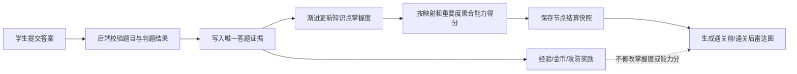
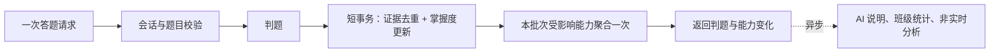

# 学生端能力图谱改进方案（讨论稿）

> 一句话定位：本文定义“真实答题证据 → 知识点掌握度 → 能力点得分 → 通关前后雷达图”的业务规则，作为学生端能力图谱改造前的讨论基线。
> 阅读前置：[`../README.md`](../README.md)、[`../common/authoring-conventions.md`](../common/authoring-conventions.md)、[`../党圣航/05-诊断跳转雷达图与题包真实轮换改进计划.md`](../党圣航/05-诊断跳转雷达图与题包真实轮换改计划.md)
> 状态：已批准，D1-D10 均已确认，按 S0-S9 顺序实施。

---

## 1. 背景

当前系统已经具备知识点掌握度、能力点映射、学生能力变化日志和雷达图接口，但数据链路存在两个根本问题：

1. 答对或答错会把知识点掌握度直接写成 `100` 或 `0`，不能反映渐进学习过程。
2. 爬塔结算会根据是否通关直接为能力加减固定分数，雷达图变化不是由真实答题证据聚合得出。

这会造成两种相反的异常体感：单题对掌握度影响过大，但能力雷达图又可能因为固定加分、重复能力点或快照不真实而看不出有意义的变化。

## 2. 目标

| 目标 | 可检验结果 |
|------|------------|
| 建立唯一学习证据链 | 任何能力得分都能追溯到知识点掌握度和具体答题记录 |
| 掌握度渐进变化 | 单题答对或答错不会直接跳到 `100` 或 `0` |
| 能力分数可重算 | 使用相同知识点数据和映射关系，每次聚合结果一致 |
| 雷达图真实反映本关学习 | 通关前后数据来自节点开始快照和结算后重新聚合 |
| 游戏奖励与学习评价解耦 | 经验、金币和属性奖励不再改动学习能力分数 |
| 防止重复和重放 | 同一份答题证据重复提交时，掌握度只更新一次 |

## 3. 具体方案与实施步骤

### 3.1 总体落地方案

本次改造不重写整个爬塔模块，而是在现有答题、知识点掌握度、能力映射和雷达图链路上逐步替换评分依据。

| 层次 | 具体方案 | 保留的现有能力 | 需要停用的旧逻辑 |
|------|----------|------------------|----------------------|
| 答题层 | 每份有效答案生成一条不可变的学习证据 | 现有题库、题包、客观题判题 | 重复请求重复计分 |
| 掌握度层 | 使用渐进公式更新 `knowledge_mastery` | 现有学生—课程—知识点唯一记录 | 答对直接写 `100`、答错直接写 `0` |
| 能力层 | 根据后端映射聚合知识点掌握度 | 现有 `ability_point` 和 `ability_knowledge_point` | 通关直接为能力加 `+3/+5/+8` |
| 快照层 | 按节点尝试保存 `before/after` 能力快照 | 现有运行、节点和尝试标识 | 查询时通过加分日志临时推断前后值 |
| 展示层 | 使用快照绘制通关前后雷达图 | 现有雷达图组件和结算页 | 用游戏奖励解释学习能力变化 |

### 3.2 数据结构方案

> 下列新表名为建议名称，最终以设计评审后的数据模型为准。

| 数据 | 方案 | 关键约束 |
|------|------|----------|
| `learning_answer_evidence` | 新增，保存每次有效作答证据及当时难度快照 | `evidence_id` 主键；`student_no + idempotency_key` 唯一 |
| `knowledge_mastery` | 保留，作为当前掌握度快速查询表 | `student_no + course_code + knowledge_point_id` 唯一 |
| `knowledge_mastery_history` | 新增，记录每条证据导致的更新前后值、`alpha` 和公式版本 | 每个 `evidence_id` 最多一条生效记录 |
| `student_ability_snapshot` | 新增，按节点尝试、阶段和能力点保存分数 | `attempt_id + phase + ability_point_id` 唯一，`phase` 为 `before/after` |
| `ability_knowledge_point` | 保留，作为能力聚合的服务端权威映射 | 能力点和知识点组合唯一 |
| `student_ability_delta_log` | 过渡期只读兼容，新雷达图不再以它的固定加分作为依据 | 待历史页面切换后再决定归档或删除 |

数据库变更优先使用新增表和新增约束，不直接覆盖或清空现有掌握度和能力日志。

### 3.3 后端调用方案

前端仍然调用一个答题或节点结算接口，后端在服务内部完成下列顺序：

```text
1. 从会话取得学生身份
2. 批量加载题目、题包、节点和课程关系
3. 校验前端提交的上下文并在后端判题
4. 使用幂等键写入本批答题证据
5. 只对本批新证据渐进更新知识点掌握度
6. 去重查找受影响的能力点，每个能力点聚合一次
7. 如果是节点最终结算，幂等写入 after 快照
8. 提交事务并返回判题、掌握度变化和能力变化
9. 事务外异步生成 AI 说明和非实时统计
```

建议将计算与流程分开：

| 服务职责 | 输入 | 输出 |
|----------|------|------|
| 证据编排 | 会话、答案、题目上下文 | 去重后的新证据 |
| 掌握度计算 | 旧掌握度、正误、难度、作答次数 | 新掌握度和计算说明 |
| 能力聚合 | 知识点掌握度、重要度、后端映射 | 能力分和证据覆盖率 |
| 快照服务 | 节点尝试、阶段、能力聚合结果 | 幂等的 `before/after` 快照 |
| 雷达图查询 | 同一节点尝试的两组快照 | 稳定的维度、前后分数和差值 |

### 3.4 前端接入方案

1. 答题组件继续提交答案、题目 ID 和必要的节点上下文，不在前端计算掌握度。
2. 节点开始接口返回或确认 `attemptId`，后端在首次开始时保存 `before` 快照。
3. 节点结算接口直接返回判题摘要、掌握度变化和雷达图 `before/after` 数据，前端不再额外串行请求多个计分接口。
4. AI 说明未完成时，结算页先展示真实分数和“分析生成中”状态，不阻塞通关。
5. 雷达图对无证据或低覆盖维度显示数据状态，不用视觉动画伪造分数变化。

### 3.5 分步实施清单

| 步骤 | 工作内容 | 产出 | 进入下一步的条件 |
|------|----------|------|--------------------|
| S0. 基线确认 | 锁定已确认的 D1-D10，并统计现有掌握度、重复能力点和映射 | 参数表、数据基线、重复预览 | 清理前已完成必要数据备份 |
| S1. 增量数据结构 | 新增证据、掌握度历史和快照结构 | 可重复执行的迁移脚本 | 旧功能可继续运行，新表约束测试通过 |
| S2. 纯计算内核 | 实现掌握度公式、重复作答折扣和能力聚合 | 不依赖网络和 AI 的计算服务 | 边界值和文档示例单元测试全部通过 |
| S3. 答题证据链 | 将现有判题结果接入幂等证据和渐进掌握度事务 | 一次答题只生效一次的后端链路 | 正常、重放、并发和回滚测试通过 |
| S4. 历史数据治理 | 合并已确认的重复能力点，迁移引用，加入同名唯一防护 | 清理报告、幂等初始化逻辑 | 连续两次运行清理和初始化，第二次零变更 |
| S5. 能力聚合 | 从清理后的知识点映射批量聚合受影响能力 | 可追溯的能力分和覆盖率 | 不接受前端能力 ID 作为计分依据 |
| S6. 节点快照 | 接入节点开始和结算，幂等保存 `before/after` | 真实前后快照和雷达图接口 | 重新进入、重复结算不改写历史 |
| S7. 前端切换 | 将学生答题和结算页切换到新返回结构 | 真实雷达图及加载、无变化和低覆盖状态 | 学生端全流程验收通过 |
| S8. 旧逻辑退出 | 停止通关固定能力加分，AI 说明改为异步 | 游戏奖励与学习评分完全解耦 | 不再有新的固定加分日志被雷达图使用 |
| S9. 全链路验收 | 执行固定答对/答错集成测试、权限测试和性能压测 | 测试报告和回滚方案 | 功能、数据一致性和 P95 指标同时达标 |

### 3.6 发布与回滚

- 数据库变更使用“先新增、后切读、最后停旧写”的顺序，不在同一步删除旧字段或旧表。
- 新评分链路应有课程级开关；试运行先限定测试课程和测试学生，不直接影响所有历史用户。
- 回滚时可停止新证据消费并恢复旧读路径，已写入的证据和快照保留供问题分析，不直接删除。
- 新旧结果对比只用于测试和运营分析，不在生产同步请求中执行两套全量计算。

## 4. 核心数据流



### 4.1 唯一事实源

- **答题证据**是掌握度变化的原始事实。
- **知识点掌握度**是学习能力的唯一计算依据。
- **能力点得分**是知识点掌握度的派生数据，不接受人为通关加分。
- **雷达图数据**是节点前后能力聚合结果的展示，不单独发明分数。

### 4.2 同步快路径与异步任务

上述数据流表示因果关系，不表示前端需要串行调用多个接口。一次答题或一批答案提交应由一个后端请求完成核心处理。



| 处理内容 | 执行时机 | 原因 |
|----------|----------|------|
| 会话、题目、题包和节点状态校验 | 同步 | 防止错误数据进入证据链 |
| 后端判题 | 同步 | 前端需要立即得到结果 |
| 证据幂等写入和知识点掌握度更新 | 同步短事务 | 保证证据和分数一致 |
| 受影响能力聚合 | 每个请求批次一次 | 避免每条答案都全量重算 |
| `before` 快照 | 节点首次开始时一次 | 重进节点不覆盖 |
| `after` 快照 | 节点最后一批证据生效后一次 | 不在每题后生成雷达快照 |
| AI 变化说明 | 异步 | 不阻塞判题和结算 |
| 班级统计、榜单和全量重算 | 异步或查询时 | 不属于学生当前答题的必要响应 |

同步路径不应调用 AI、外部网络服务或全课程统计。题目元数据和能力映射可以缓存，教师修改题目或映射时再精确失效对应课程缓存。

## 5. 答题证据规则

### 5.1 最小证据字段

| 字段 | 含义 | 约束 |
|------|------|------|
| `evidenceId` | 证据唯一标识 | 不可重复 |
| `studentNo` | 学生 | 必填，从登录会话取得 |
| `courseCode` | 课程 | 必填，由题目和节点校验 |
| `questionId` | 题目 | 必填，必须存在于后端题库 |
| `knowledgePointId` | 知识点 | 必填，从后端题目关系解析 |
| `difficulty` | 作答时题目难度 | `1~5`，保存当时快照 |
| `attemptNo` | 该学生对该题的第几次有效作答 | 从 `1` 开始，由后端计算 |
| `firstAttempt` | 是否首次有效作答 | `attemptNo = 1` 时为真 |
| `correct` | 判题结果 | 由后端判题或教师审核结果产生 |
| `sourceType` | 证据来源 | 如 `tower`、`quiz`、`exam` |
| `sourceId` | 来源作答/提交记录 | 用于追溯 |
| `idempotencyKey` | 幂等键 | 同一答案重放时不重复计分 |
| `answeredAt` | 服务器接收有效答案的时间 | 由后端写入 |

### 5.2 前端数据的信任分层

本方案不采用“前端数据一律不可信”的绝对表述。前端是学生交互事实的必要来源，但不同字段对学习评价的影响不同，应按下表分层处理：

| 信任层级 | 前端可提交的典型数据 | 后端处理原则 | 是否可直接影响评分 |
|----------|------------------------|--------------|----------------------|
| A. 事实输入 | 学生答案、选项、代码、操作类型 | 完成类型、长度和内容安全校验后接收 | 不直接影响，必须先判题 |
| B. 定位与上下文 | `questionId`、`runId`、`nodeId`、`attemptId`、`courseCode` | 与登录学生、题包、节点状态和课程归属交叉校验 | 校验通过后可用于定位证据 |
| C. 客户端幂等信息 | `idempotencyKey`、客户端请求序号 | 绑定学生、作答与请求内容摘要，防止一键多用 | 只用于防重，不决定分数 |
| D. 可携带的参考值 | `knowledgePointId`、`abilityPointId`、`difficulty`、`correct` | 可用于界面上下文、调试和一致性对比；与后端结果冲突时以后端为准并记录异常 | 不可未经校验直接影响 |
| E. 身份与权限 | `studentNo`、角色、授课关系 | 前端可为展示携带，但后端必须从已认证会话和权限数据取得 | 不可作为授权依据 |

其中，“后端确定”不意味着禁止前端传递同名字段，而是指该字段在进入掌握度公式前必须经过服务端校验或重新推导。

### 5.3 证据边界

**R1.1** 当学生提交答案时，系统应接收前端提交的答案、题目标识和必要上下文，并在格式校验后进入后端判题流程。

**R1.2** 当前端提交课程、节点、知识点、能力点、难度或判题结果时，系统应接收其作为上下文或一致性校验输入，但在影响学习评分前必须与后端题库、题包、映射和判题结果核对。

**R1.3** 当同一 `idempotencyKey` 被重复提交时，系统应返回首次处理结果，不应再次更新掌握度。

**R1.4** 当客观题判题完成时，系统应在同一业务事务中保存答题证据并更新知识点掌握度。

**R1.5** 对于需要教师复核的主观题，在最终判定生效前，系统不应用临时 AI 结果更新掌握度。

**R1.6** 如果题目没有有效知识点关联，则系统应保留作答记录并标记“不可用于掌握度计算”，不应猜测能力点。

**R1.7** 当前端参考值与后端权威数据不一致时，系统应使用后端值继续安全可处理的流程，并对可疑冲突记录可追踪日志；如果冲突使请求无法唯一定位，则应拒绝计分。

## 6. 知识点掌握度

### 6.1 更新公式

```text
target = correct ? 100 : 0
newMastery = round(oldMastery + alpha * (target - oldMastery))
newMastery = clamp(newMastery, 0, 100)
```

其中 `alpha` 是本次证据的权重，由题目难度和作答次数决定：

```text
alpha = difficultyWeight[difficulty] * attemptFactor[attemptNo]
```

### 6.2 计算参数

| 难度 | 1 | 2 | 3 | 4 | 5 |
|------|---|---|---|---|---|
| `difficultyWeight` | 0.10 | 0.12 | 0.14 | 0.16 | 0.18 |

| 作答次数 | 首次 | 第 2 次 | 第 3 次及以后 |
|----------|------|---------|----------------|
| `attemptFactor` | 1.00 | 0.50 | 0 |

以难度 `3`、首次作答为例，`alpha = 0.14`：

| 旧掌握度 | 结果 | 新掌握度 |
|------------|------|------------|
| 50 | 答对 | `round(50 + 0.14 × 50) = 57` |
| 50 | 答错 | `round(50 + 0.14 × -50) = 43` |
| 80 | 答对 | `83` |
| 80 | 答错 | `69` |

> 说明：初始掌握度 `50`、难度权重 `0.10/0.12/0.14/0.16/0.18` 和作答折扣 `1.00/0.50/0` 均已确认。第 3 次及以后仍保存答题证据，但不再改变掌握度。

### 6.3 掌握度需求

**R2.1** 当首次有效答题证据到达且该知识点没有历史掌握度时，系统应以 `50` 作为 `oldMastery` 进行渐进更新。

**R2.2** 当后续证据到达时，系统应基于当前掌握度和本次 `alpha` 更新，不应直接写入 `0` 或 `100`。

**R2.3** 当学生重复作答同一题目时，第 2 次有效作答的权重应降为首次的 `0.50`，第 3 次及以后的权重应为 `0`，防止反复刷同一题改变能力分。

**R2.4** 系统应保留每次更新前后的掌握度、权重、目标值和证据标识，以支持审计和重算。

**R2.5** 如果同一学生的同一知识点被并发更新，则系统应保证每条唯一证据恰好生效一次，且结果不丢失更新。

## 7. 能力点聚合

### 7.1 聚合公式

一个能力点可关联多个知识点，能力分数由这些知识点掌握度加权平均得出：

```text
abilityScore = round(
    sum(knowledgeMastery[i] * importance[i])
    / sum(importance[i])
)
```

- `importance` 取知识点重要度，缺省时按 `1` 计算。
- 未作答知识点以掌握度 `50` 参与聚合，并单独计算证据覆盖率。
- 能力点不再维护独立的人工累加分数。
- 聚合时仅使用与当前课程同属的有效映射。

### 7.2 聚合需求

**R3.1** 当知识点掌握度发生变化时，系统应通过后端维护的“能力点—知识点”映射重新聚合受影响的能力点。

**R3.2** 前端可提交能力点 ID 用于界面定位和一致性校验；当计算受影响的能力点时，系统应以后端维护的知识点映射为准。

**R3.3** 当一个知识点映射到多个能力点时，系统应为每个受影响的能力点重新聚合。

**R3.4** 当能力点没有关联知识点时，系统应将其标记为“无计算依据”，不应生成伪造的能力提升。

**R3.5** 当关联知识点部分没有作答证据时，能力点应同时返回得分、有证据知识点数和总关联知识点数，以便前端表示置信度不足。

## 8. 节点快照与雷达图

### 8.1 快照时机

| 时机 | 快照 | 内容 |
|------|------|------|
| 节点正式开始 | `before` | 开始时所有课程能力点的聚合分数 |
| 最后一份有效答题证据处理完成 | `after` | 基于新掌握度重新聚合的分数 |
| 节点结算页打开 | 只读 | 读取已保存的前后快照，不在查询时重写历史 |

### 8.2 雷达图需求

**R4.1** 当学生首次进入可答题节点时，系统应保存该节点的能力 `before` 快照，重新进入同一次节点尝试时不应覆盖。

**R4.2** 当节点完成或失败且所有有效证据已处理时，系统应重新聚合能力得分并保存 `after` 快照。

**R4.3** 雷达图应使用同一节点尝试的 `before` 和 `after` 快照，并展示每个维度的真实差值。

**R4.4** 如果本次没有可用学习证据，则 `before` 和 `after` 应相同，并明确标记“本次无能力变化”。

**R4.5** 当节点只有游戏奖励而没有答题证据时，系统不应改变任何知识点掌握度或能力点得分。

**R4.6** 系统应将经验、金币、攻击、防御等游戏属性与学习能力分数分开返回和展示。

## 9. 能力点重复数据治理

### 9.1 清理原则

**R5.1** 系统应以“课程 + 标准化能力名称”判定重复，标准化至少忽略首尾空格和英文大小写。

**R5.2** 当发现重复能力点时，迁移过程应先确定保留记录，将知识点映射、快照和历史引用迁移到保留记录，再删除重复记录。

**R5.3** 如果合并后出现重复的能力点—知识点映射，则系统应只保留一条。

**R5.4** 历史数据治理应在事务中执行，执行前应生成重复组、保留 ID、被合并 ID 和引用数量的预览报告。

**R5.5** 完成历史清理后，系统应在数据库层防止同一课程再次出现同名能力点。

**R5.6** 初始化逻辑应以“课程 + 标准化能力名称”幂等写入，重复执行不得新增能力点或重复映射。

### 9.2 已确认的保留记录顺序

1. 优先保留有有效知识点映射的记录。
2. 映射数量相同时，优先保留被历史快照或日志引用的记录。
3. 仍然无法区分时，保留创建时间最早或 ID 最小的记录。

## 10. 完整业务需求

### R6 组：安全与一致性

**R6.1** 系统应在后端完成判题、证据写入、掌握度更新和受影响能力聚合的一致性控制。

**R6.2** 如果证据写入或掌握度更新失败，则系统不应返回“能力已更新”。

**R6.3** 系统应记录掌握度变化的公式版本，以便后续调整参数时区分历史口径。

**R6.4** 当能力映射关系在一次节点尝试期间被教师修改时，该次尝试的前后快照应使用同一映射版本或保存快照中的维度集，避免将配置变更误判为学习变化。

### R7 组：性能与响应路径

**R7.1** 当前端提交一题或一批答案时，系统应通过一次业务请求返回判题和必要的掌握度变化，不应要求前端串行编排证据、掌握度、能力点和快照接口。

**R7.2** 当一个请求包含多条答案时，系统应批量加载题目和映射，并在所有证据更新后对受影响能力去重聚合一次。

**R7.3** 学生答题的同步响应路径不应调用 AI、外部网络服务、班级统计或全课程全量重算。

**R7.4** 能力聚合应仅查询本批知识点所影响的能力点，并使用批量查询避免按能力点或知识点逐条访问数据库。

**R7.5** 在同地域正常网络、数据库健康且不包含文件上传的条件下，单次答题接口端到端 `P95` 目标应不超过 `500ms`，节点最终结算接口 `P95` 目标应不超过 `1000ms`。

## 11. 验收标准

### 11.1 计算验收

| 场景 | 前置 | 期望 |
|------|------|------|
| 首次答对 | 初始掌握度 50，难度 3 | 掌握度变为 57 |
| 首次答错 | 初始掌握度 50，难度 3 | 掌握度变为 43 |
| 重复答对 | 掌握度 50，难度 3，第 2 次 | 掌握度变为 54，变化小于首次作答 |
| 第 3 次及以后作答 | 任意掌握度和难度 | 保存答题证据，掌握度不变 |
| 重放同一请求 | 相同幂等键提交两次 | 只生成一条证据，掌握度只变化一次 |
| 能力聚合 | 两知识点分别为 60/80，重要度为 1/3 | 能力分为 75 |
| 游戏奖励 | 完成无答题的宝箱或休息节点 | 游戏属性变化，掌握度和能力分不变 |

### 11.2 集成验收

1. 固定一名学生、一门课程、一个能力点和两个关联知识点。
2. 启动节点尝试，记录 `before` 快照。
3. 连续提交固定的答对、答错和重复作答组合。
4. 验证答题证据、知识点掌握度、能力点聚合分数和 `after` 快照均符合同一计算链路。
5. 调用雷达图接口，验证每个维度的 `beforeScore`、`afterScore` 和 `delta` 与快照完全一致。
6. 重放结算请求，验证不新增证据、不二次更新掌握度、不改写快照。
7. 对清理脚本进行两次连续执行，第二次应报告零条变更。
8. 对初始化脚本进行两次连续执行，能力点和映射数量应与第一次一致。

## 12. 决策确认表

| 编号 | 决策项 | 当前结论 | 状态 | 影响 |
|------|--------|----------|------|------|
| D1 | 无历史证据时的初始掌握度 | `50` | 已确认 | 决定首题变化幅度 |
| D2 | 难度权重 | `0.10/0.12/0.14/0.16/0.18` | 已确认 | 决定不同难度证据的影响 |
| D3 | 重复作答折扣 | `1.00/0.50/0`，第 3 次及以后不再改变掌握度 | 已确认 | 限制反复练习对评分的影响 |
| D4 | “首次作答”范围 | 同一学生 + 同一题目的全局首次 | 已确认 | 影响跨任务重复题 |
| D5 | 未作答知识点如何参与能力聚合 | 以 `50` 参与，同时返回证据覆盖率 | 已确认 | 影响新学生雷达图 |
| D6 | 主观题何时成为有效证据 | 教师复核后 | 已确认 | 影响简答题和编程题链路 |
| D7 | 能力映射版本化 | 每次评价开始时读取最新映射并冻结，本次评价前后使用同一口径 | 已确认 | 影响历史雷达图稳定性 |
| D8 | 历史重复能力点的保留 ID | 保留原来创建的能力点，迁移新记录的有效引用后删除新重复项 | 已确认 | 影响历史引用迁移 |
| D9 | 答题和节点结算的性能目标 | 答题 `P95 ≤ 500ms`，结算 `P95 ≤ 1000ms` | 已确认 | 决定压测环境和上线门槛 |
| D10 | 旧 `0/100` 掌握度如何迁移 | 有完整答题历史时离线重算；无完整证据时直接改为初始掌握度 `50`，不保留 `legacy` 计分基线 | 已确认 | 老学生将按新口径重新累积 |

### 12.1 D7：为什么要考虑能力映射变化

能力映射表示“某个能力点由哪些知识点组成”。教师以后可能会修改这个关系。

例如：

```text
学生开始答题时：
  Python 基础能力 = 变量 + 条件语句

学生答题期间，教师修改为：
  Python 基础能力 = 变量 + 条件语句 + 循环
```

如果结算时直接使用最新映射重算，雷达图的变化可能来自教师新增了“循环”，而不是学生的答题表现。

**建议的简化方案**：第一期不建复杂的全局映射版本管理系统。节点开始时，在 `before` 快照中保存能力点 ID、名称、分数、证据覆盖率，以及本次聚合使用的知识点 ID 和权重。结算时使用这组已冻结的知识点和权重计算 `after`，确保前后口径一致。历史雷达图始终读快照，不用教师后来修改的映射覆盖旧结果。

### 12.2 D8：为什么合并重复能力点要选择保留 ID

现在同名能力点可能有两个不同的数据库 ID。页面上看起来名称相同，但知识点映射、历史日志和快照引用的是 ID，不是名称。

例如：

```text
AP-01  Python 基础能力  -> 已绑定 3 个知识点
AP-09  Python 基础能力  -> 没有映射
```

如果删除 `AP-01` 只保留 `AP-09`，原来的映射就会断开。因此必须先选出一个保留 ID，把另一个 ID 的映射和历史引用迁过来，最后才删除重复记录。

**建议的选择顺序**：先保留有知识点映射的 ID；如果两个都有映射，保留被历史数据引用更多的 ID；仍然相同时，保留最早创建的 ID。执行前先给出预览报告，不直接删除。

## 13. 技术约束

- 后端使用 Java 17、Spring Boot 3.5 和 MyBatis-Plus。
- 数据库需同时兼容 PostgreSQL 和 KingbaseES V9 兼容模式。
- 前端负责采集答案、发起用户操作、传递必要上下文并展示判题与雷达图结果；最终学习评价分数由后端在校验这些输入后计算。
- 学生只能读取自己的答题证据、掌握度和能力快照。
- 所有分数范围为 `0~100`，对外返回时使用整数；中间计算精度 `[待定]`。

## 14. 不做（明确排除）

- 本阶段不使用 AI 直接决定掌握度或能力分数。
- 本阶段不将观看视频、登录、签到、游戏金币或经验值视为掌握度证据。
- 本阶段不引入 IRT、BKT 等需要大量样本校准的模型；保留日后使用证据历史升级的可能。
- 本文不批准直接删除现有重复能力点，必须先生成迁移预览并人工确认。
- 本文不包含代码实现和数据库执行脚本。
